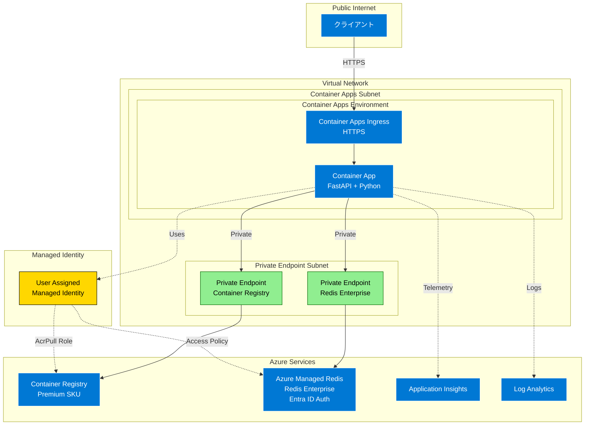

# Azure Container Apps Chaos Lab

Azure Container Apps上で動作するアプリケーションの障害耐性をテストするためのカオスエンジニアリング環境です。Azure SRE Agentの動作検証を目的として設計されています。

## 概要

Azure Container Apps Chaos Labは、制御された環境で障害を注入し、システムの応答を観察するための機能を提供します：

- **FastAPIアプリケーション**: Redis統合と可観測性を備えたWebサービス
- **カオス注入API**: 様々な障害シナリオをトリガーするエンドポイント
- **インフラストラクチャスクリプト**: ネットワークやデプロイ障害のためのAzureリソース操作ツール
- **負荷テスト**: カオス注入機能を含むLocustベースの負荷テストシナリオ
- **高い可観測性**: 分散トレーシングを含むApplication Insights統合

## アーキテクチャ



## 機能

### カオス注入機能

1. **負荷シミュレーション**
   - CPU負荷生成（低/中/高）
   - メモリ割り当てストレス
   - 並行負荷パターン

2. **ネットワーク障害**
   - NSGルールによるRedis接続の遮断

3. **アプリケーションハング**
   - 一時的または永続的な無応答状態
   - 呼び出したリクエストのみが応答を返さない（他のAPIは正常動作）

4. **Redis接続リセット**
   - Redis接続の強制切断
   - 接続障害と再接続のシミュレーション

5. **デプロイメント障害**
   - 起動時の失敗（exit 1）
   - 無効な環境変数

### 可観測性

- **OpenTelemetry統合**: 主要コンポーネントでOpenTelemetryによる自動計装
- **Application Insights**: 分散トレーシングとカスタムメトリクスによる詳細な監視
- **テレメトリ一貫性**: 例外処理、Redis接続、カオス操作の統一されたテレメトリ記録
- **パフォーマンス最適化**: 1ms未満の軽微なオーバーヘッドでの高性能テレメトリ
- **カスタムメトリクス**: 
  - Redis接続状態とレスポンス時間
  - カオス操作の実行状況と成功率
  - 例外発生時の自動スパンエラー記録
- **設定可能**: テレメトリ機能の有効/無効を環境変数で制御可能
- **Container Apps監視**: 応答監視アラート（5xxエラー、応答時間）

## デプロイメント戦略

### Container App Upsert戦略

このプロジェクトは、Azure Verified Module (AVM) の [Container App upsert戦略](https://learn.microsoft.com/azure/developer/azure-developer-cli/container-apps-workflows#container-app-upsert-strategy) を採用しています。

#### 主な特徴

- **インクリメンタル更新**: 既存のContainer Appを完全に置換せずに、変更された部分のみを更新
- **設定保持**: 明示的に変更されない設定値（環境変数、スケーリング設定等）を自動的に保持
- **条件付きイメージ更新**: 新しいコンテナイメージが指定された場合のみ更新、未指定時は既存イメージを保持
- **ダウンタイム削減**: リソース全体の置換ではなく部分更新によりダウンタイムを最小化

#### 実装技術

- **Azure Verified Module**: `br/public:avm/ptn/azd/container-app-upsert:0.1.2`
- **条件付きロジック**: `!empty(containerAppImageName) ? containerAppImageName : ''`
- **azd統合**: Azure Developer CLIとの完全な互換性
- **ヘルスプローブ自動設定**: postprovisionフックにより、AVMでサポートされていないヘルスプローブを自動的に追加
  - Liveness Probe: 30秒遅延、10秒間隔で`/health`エンドポイントを監視
  - Readiness Probe: 5秒遅延、5秒間隔で`/health`エンドポイントを監視
  - 冪等性により、既存のプローブ設定を適切に検出・保持

この戦略により、開発・テスト・本番環境での安定したデプロイメントと運用効率の向上を実現しています。

## 前提条件

### 必須ツール
- **Azure サブスクリプション**: 適切な権限（Contributor以上）が必要
- **[Azure Developer CLI (azd)](https://learn.microsoft.com/azure/developer/azure-developer-cli/install-azd)**: v1.18.0以上
  - インフラストラクチャのプロビジョニングとデプロイ
  - 環境変数の管理
- **[Azure CLI](https://docs.microsoft.com/cli/azure/install-azure-cli)**: v2.75.0以上
  - Azureリソースの操作
  - 障害注入スクリプトの実行
- **[Docker](https://www.docker.com/get-started)**: v28.3以上
  - コンテナイメージのビルド（azdが自動的に使用）
- **[jq](https://jqlang.github.io/jq/)**: v1.6以上
  - JSONデータの処理とクエリ
  - ヘルスプローブ自動設定スクリプトで使用
- **Bash シェル**: 
  - Linux/macOS: 標準搭載
  - Windows: WSL2、Git Bash、またはAzure Cloud Shellを使用

### 負荷テスト用
- **Python**: 3.13以上（Locustを実行するため必須）
- **[uv](https://github.com/astral-sh/uv)**: Pythonパッケージマネージャー（推奨）

### アプリケーション開発用（オプション）
- 上記のPython環境（既に負荷テスト用にインストール済みの場合は追加不要）

## クイックスタート

### ローカル開発

1. リポジトリのクローンと移動：
   ```bash
   git clone https://github.com/torumakabe/aca-chaos-lab.git
   cd aca-chaos-lab
   ```

2. Python環境のセットアップ：
   ```bash
   # srcディレクトリに移動
   cd src
   
   # uvのインストール（未インストールの場合）
   pip install uv
   
   # 依存関係のインストール（開発用ツール含む）
   uv sync --extra dev
   ```

3. ローカル実行：
   ```bash
   # 引き続きsrcディレクトリで実行
   # Redisなしで実行（ローカルテスト用）
   REDIS_ENABLED=false uv run uvicorn app.main:app --reload
   
   # 注意: azdデプロイ後の環境でも、RedisはVNet内のプライベートエンドポイント経由でのみアクセス可能なため、
   # ローカル環境からは接続できません。ローカルでRedis機能をテストする場合は、
   # ローカルRedisインスタンスを起動するか、REDIS_ENABLED=falseで実行してください。
   ```

### Azureへのデプロイ

1. Azure Developer CLIの初期化：
   ```bash
   # プロジェクトルートディレクトリに戻る
   cd ..  # srcディレクトリから戻る
   
   # azdの初期化（初回のみ）
   azd init
   ```

2. インフラストラクチャとアプリケーションのデプロイ：
   ```bash
   # プロジェクトルートディレクトリで実行
   azd up
   ```
   このコマンドで以下がすべて自動的に実行されます：
   - インフラストラクチャのプロビジョニング（VNet、Redis、Container Registry等）
   - Dockerイメージのビルド
   - Container Registryへのプッシュ
   - Container Appへのデプロイ
   - マネージドIDの設定（Redisアクセスポリシー、ACR Pull権限）
   - **ヘルスプローブの自動設定**: postprovisionフックにより、Liveness（30秒遅延、10秒間隔）とReadiness（5秒遅延、5秒間隔）プローブが`/health`エンドポイントに自動的に設定されます

3. 動作確認：
   ```bash
   # プロジェクトルートディレクトリで実行
   # エンドポイントURLの取得
   APP_URL=$(azd env get-value SERVICE_APP_URI)
   
   # ヘルスチェック
   curl "${APP_URL}/health"
   ```

## APIエンドポイント

### 基本エンドポイント

- `GET /` - Redis操作を含むメインエンドポイント
- `GET /health` - ヘルスチェックエンドポイント
- `GET /chaos/status` - 現在のカオス状態

### カオス注入

- `POST /chaos/load` - CPU/メモリ負荷の開始
  ```json
  {
    "level": "medium",
    "duration_seconds": 60
  }
  ```

- `POST /chaos/hang` - アプリケーションハングの発生
  ```json
  {
    "duration_seconds": 30
  }
  ```

### エラーレスポンス

すべてのAPIエンドポイントは標準化されたエラーレスポンス形式を返します：

```json
{
  "error": "Bad Request",
  "detail": "Invalid load level. Must be 'low', 'medium', or 'high'",
  "timestamp": "2025-07-29T10:30:00Z",
  "request_id": "abc123-def456-ghi789"
}
```

## カオススクリプト

すべてのスクリプトはazd環境変数に対応しています。`azd up`の後、パラメータを指定せずに実行できます。

**実行場所：プロジェクトルートディレクトリ** (`aca-chaos-lab/`)

### ネットワーク障害注入

```bash
# プロジェクトルートディレクトリで実行
# azd環境変数を使用（60秒間の障害）
./scripts/inject-network-failure.sh

# またはパラメータを明示的に指定
./scripts/inject-network-failure.sh <resource-group> <nsg-name> 60

# すべてのネットワーク障害をクリア
./scripts/clear-network-failures.sh

# アクティブなカオスルールを一覧表示
./scripts/list-network-failures.sh
```

### デプロイメント障害注入

```bash
# プロジェクトルートディレクトリで実行
# azd環境変数を使用（デフォルト: startup-failure）
./scripts/inject-deployment-failure.sh

# 障害タイプを指定
./scripts/inject-deployment-failure.sh bad-env

# デプロイメントを復元
# シングルリビジョンモードでは、新しいデプロイメントが自動的に古いリビジョンを置き換えます
azd deploy

# リビジョンを一覧表示
./scripts/list-revisions.sh
```

## 負荷テスト

様々な負荷テストシナリオの実行：

**実行場所：負荷テストディレクトリ** (`aca-chaos-lab/src/tests/load/`)

```bash
# プロジェクトルートディレクトリから負荷テストディレクトリに移動
cd src/tests/load

# ベースラインテスト（カオスなし）
./run-load-tests.sh baseline

# ストレステスト（段階的な負荷増加）
./run-load-tests.sh stress

# スパイクテスト（急激な負荷）
./run-load-tests.sh spike

# カオステスト（障害注入あり）
./run-load-tests.sh chaos

# 負荷テスト完了後はプロジェクトルートに戻る
cd ../../..
```

## テスト

### ユニットテスト

**実行場所：srcディレクトリ** (`aca-chaos-lab/src/`)

```bash
# プロジェクトルートディレクトリからsrcディレクトリに移動
cd src

# ユニットテストの実行
uv run pytest tests/unit/ -v

# テスト完了後はプロジェクトルートに戻る（必要に応じて）
cd ..
```

### 統合テスト

**実行場所：srcディレクトリ** (`aca-chaos-lab/src/`)

```bash
# プロジェクトルートディレクトリからsrcディレクトリに移動
cd src

# テスト環境変数の設定
export TEST_BASE_URL=https://myapp.azurecontainerapps.io
export TEST_RESOURCE_GROUP=my-resource-group
export TEST_NSG_NAME=my-nsg
export TEST_CONTAINER_APP_NAME=my-app

# 統合テストの実行
uv run pytest tests/integration/ -v -m e2e

# テスト完了後はプロジェクトルートに戻る（必要に応じて）
cd ..
```

## 開発

### コード品質

**実行場所：srcディレクトリ** (`aca-chaos-lab/src/`)

```bash
# プロジェクトルートディレクトリからsrcディレクトリに移動
cd src

# リンティング
uv run ruff check app/

# 型チェック
uv run mypy app/

# 自動修正
uv run ruff check app/ --fix

# 開発作業完了後はプロジェクトルートに戻る（必要に応じて）
cd ..
```

### Dockerイメージのビルド

**実行場所：srcディレクトリ** (`aca-chaos-lab/src/`)

```bash
# プロジェクトルートディレクトリからsrcディレクトリに移動
cd src

# Dockerイメージのビルド
docker build -t aca-chaos-lab:latest .

# ビルド完了後はプロジェクトルートに戻る（必要に応じて）
cd ..
```

## 環境変数

### アプリケーション環境変数

| 変数名 | 説明 | デフォルト | azd環境変数 |
|--------|------|-----------|---------------|
| `REDIS_HOST` | Redisホスト名 | localhost | `AZURE_REDIS_HOST` |
| `REDIS_PORT` | Redisポート | 10000 | `AZURE_REDIS_PORT` |
| `REDIS_ENABLED` | Redis接続を有効化 | true | - |
| `REDIS_SSL` | Redis SSL接続を有効化 | true | - |
| `REDIS_MAX_CONNECTIONS` | Redis接続プール最大接続数 | 50 | - |
| `REDIS_SOCKET_TIMEOUT` | Redisソケットタイムアウト（秒） | 3 | - |
| `REDIS_SOCKET_CONNECT_TIMEOUT` | Redisソケット接続タイムアウト（秒） | 3 | - |
| `REDIS_MAX_RETRIES` | Redis最大リトライ回数 | 1 | - |
| `REDIS_BACKOFF_BASE` | Redis指数バックオフベース時間（秒） | 1 | - |
| `REDIS_BACKOFF_CAP` | Redis指数バックオフ上限時間（秒） | 3 | - |
| `APPLICATIONINSIGHTS_CONNECTION_STRING` | App Insights接続文字列 | なし | `APPLICATIONINSIGHTS_CONNECTION_STRING` |
| `LOG_LEVEL` | アプリケーションログレベル | INFO | - |
| `APP_PORT` | アプリケーションポート | 8000 | - |
| `AZURE_CLIENT_ID` | マネージドアイデンティティのクライアントID | なし | `AZURE_MANAGED_IDENTITY_CLIENT_ID` |
| `AZURE_TENANT_ID` | Azure ADテナントID（オプション） | なし | - |

### azd環境変数

azdが管理する環境変数の確認と取得：

```bash
# 環境変数の一覧表示
azd env get-values

# 特定の値を取得（例）
azd env get-value SERVICE_APP_URI
azd env get-value AZURE_RESOURCE_GROUP
azd env get-value SERVICE_APP_NAME
```

## トラブルシューティング

### デプロイメントエラー

#### "InvalidTemplate" エラー
- **症状**: `The template resource requires an API version`
- **原因**: BicepテンプレートでAPIバージョンが不足
- **解決**: 最新のBicepテンプレートを取得してください

#### デプロイメント失敗時の対処
```bash
# 既存のリソースを削除
azd down --force --purge

# 削除完了を確認（5-15分程度かかる場合があります）
az group list --query "[?starts_with(name, 'rg-aca-chaos-lab')].name" -o table

# 削除完了後、再デプロイ
azd up
```

### 障害注入の動作

#### NSGルール変更が即座に反映されない
- **症状**: ネットワーク障害を注入してもRedis接続が継続する
- **原因**: Redis接続プールが既存の接続を保持している
- **対処**: 
  - Redis再接続APIを使用して接続をリセット：
    ```bash
    curl -X POST "${APP_URL}/chaos/redis-reset"
    ```
  - これにより、既存の接続プールがクリアされ、新しいネットワークルールが適用されます

#### ハングアップAPIのタイムアウト
- **症状**: ハングAPIを呼び出してもクライアントがタイムアウトする
- **原因**: これは想定される動作（永続的ハングの場合）
- **対処**: 
  - 時限的ハング（duration指定）を使用
  - 別のターミナルから状態確認API（/chaos/status）で確認

## アラート設定

Container Appsの応答状況を監視するための自動アラートが設定されています：

### 5xxエラーアラート
- **メトリクス**: Container AppsのRequestsメトリクス（StatusCodeCategory = 5xx）
- **閾値**: 5分間で5回以上の5xxエラー
- **評価頻度**: 1分ごと
- **重要度**: 警告（Severity 2）

### 応答時間アラート
- **メトリクス**: Container AppsのResponseTimeメトリクス
- **閾値**: 平均応答時間が5秒（5000ms）を超過
- **評価頻度**: 1分ごと
- **重要度**: 警告（Severity 2）

### アラートの確認方法
1. Azure Portalにログイン
2. デプロイされたリソースグループに移動
3. アラートルールを確認：
   - `{container-app-name}-5xx-alerts`
   - `{container-app-name}-response-time-alerts`

**注意**: Azure SRE Agentとの統合を想定しているため、現在アクショングループは設定されていません。メール通知などが必要な場合は、Azure Portalからアクショングループを追加してください。

## セキュリティ考慮事項

- **認証**
  - Redis認証にEntra ID（ユーザー割り当てマネージドアイデンティティ）を使用
  - パスワードレス認証により、資格情報の漏洩リスクを排除
  - トークンの自動更新により、期限切れによる接続エラーを防止
- **ネットワークセキュリティ**
  - VNet統合によるプライベートネットワーク内での通信
  - Private Endpointを使用してRedisへの接続を保護
  - Container RegistryはPrivate Endpointを持ちつつ、開発者の利便性のためパブリックアクセスも許可
- **データ保護**
  - RedisへのSSL/TLS接続（ポート10000）
  - コード内にパスワードや接続文字列を含まない
  - 環境変数を使用した設定管理
- **監査とモニタリング**
  - Application Insightsによる包括的なテレメトリ収集
  - 分散トレーシングによる操作の追跡
  - 異常検知のためのカスタムメトリクス
  - 自動アラートによる問題の早期検出

## パフォーマンス最適化

### テレメトリサンプリング
- **標準OpenTelemetryサンプリング**: 環境変数 `OTEL_TRACES_SAMPLER=traceidratio`, `OTEL_TRACES_SAMPLER_ARG=0.1` による10%サンプリング
- **コスト最適化**: 負荷テスト時のテレメトリコストを大幅削減
- **標準準拠**: 業界標準のOpenTelemetryサンプリング手法を採用

### Redis最適化
- **ヘルスチェックキャッシュ**: 5秒間のレスポンスキャッシュによりRedis PINGアクセスを削減
- **リクエストカウンター削減**: 90%削減（10回に1回のみ実行）によりRedis負荷を軽減
- **接続プール最適化**: 環境変数による接続プール設定のカスタマイズ対応

### パフォーマンス指標
- **テレメトリ**: 10%サンプリングによりコスト削減と可視性のバランスを実現
- **Redis操作**: ヘルスチェック頻度90%削減、リクエストカウンター90%削減
- **レスポンス時間**: キャッシュ活用により平均レスポンス時間を改善

## ライセンス

MITライセンス - 詳細は[LICENSE](LICENSE)ファイルを参照
