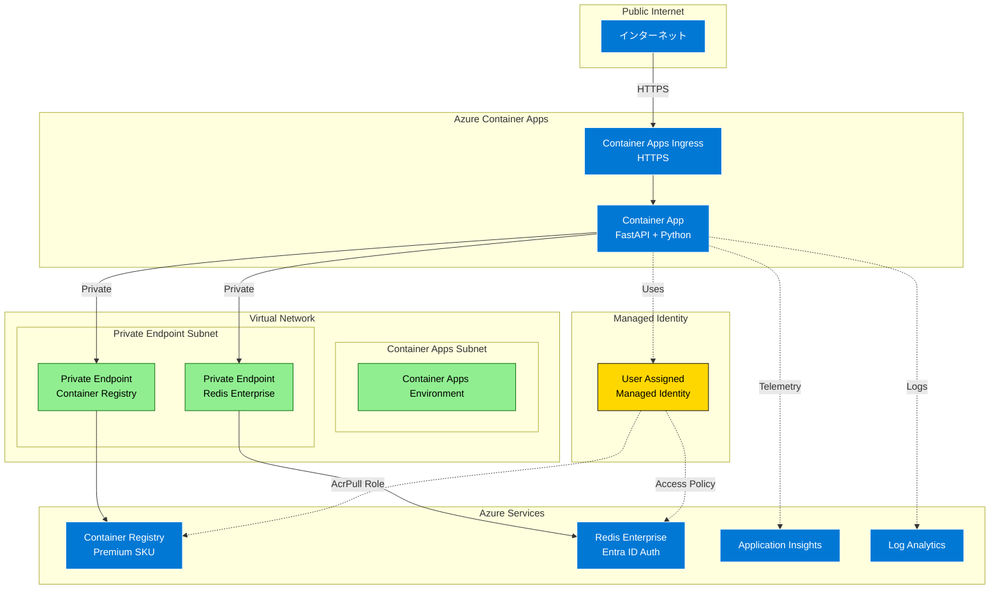

# Azure Container Apps カオスラボ

Azure Container Apps上で動作するアプリケーションの障害耐性をテストするためのカオスエンジニアリング環境です。Azure SRE Agentの動作検証を目的として設計されています。

## 概要

Azure Container Apps カオスラボは、制御された環境で障害を注入し、システムの応答を観察するための機能を提供します：

- **FastAPIアプリケーション**: Redis統合と可観測性を備えたWebサービス
- **カオス注入API**: 様々な障害シナリオをトリガーするエンドポイント
- **インフラストラクチャスクリプト**: ネットワークやデプロイ障害のためのAzureリソース操作ツール
- **負荷テスト**: カオス注入機能を含むLocustベースの負荷テストシナリオ
- **完全な可観測性**: 分散トレーシングを含むApplication Insights統合

## アーキテクチャ



## 機能

### カオス注入機能

1. **負荷シミュレーション**
   - CPU負荷生成（低/中/高）
   - メモリ割り当てストレス
   - 並行負荷パターン

2. **ネットワーク障害**
   - NSGルールによるRedis接続の遮断
   - 指定時間後の自動復旧

3. **アプリケーションハング**
   - 一時的または永続的な無応答状態
   - デッドロックやブロッキング操作のシミュレーション

4. **デプロイメント障害**
   - 存在しないコンテナイメージ
   - 無効な環境変数
   - メモリ不足状態

### 可観測性

- すべてのコンポーネントのOpenTelemetry計装
- Application Insights統合
- RedisとHTTP呼び出しの分散トレーシング
- カオス操作のカスタムメトリクスとイベント

## 前提条件

### 必須ツール
- **Azure サブスクリプション**: 適切な権限（Contributor以上）が必要
- **[Azure Developer CLI (azd)](https://learn.microsoft.com/azure/developer/azure-developer-cli/install-azd)**: v1.5.0以上
  - インフラストラクチャのプロビジョニングとデプロイ
  - 環境変数の管理
- **[Azure CLI](https://docs.microsoft.com/cli/azure/install-azure-cli)**: v2.50.0以上
  - Azureリソースの操作
  - 障害注入スクリプトの実行
- **[Docker](https://www.docker.com/get-started)**: v20.10以上
  - コンテナイメージのビルド（azdが自動的に使用）

### ローカル開発用（オプション）
- **Python**: 3.11以上
- **[uv](https://github.com/astral-sh/uv)**: Pythonパッケージマネージャー（推奨）

## クイックスタート

### ローカル開発

1. リポジトリのクローン：
   ```bash
   git clone https://github.com/torumakabe/aca-chaos-lab.git
   cd aca-chaos-lab
   ```

2. Python環境のセットアップ：
   ```bash
   cd src
   pip install uv
   uv venv
   source .venv/bin/activate  # Windowsの場合: .venv\Scripts\activate
   uv pip install -e ".[dev]"
   ```

3. ローカル実行：
   ```bash
   # Redisなしで実行（ローカルテスト用）
   export REDIS_ENABLED=false
   uvicorn app.main:app --reload
   
   # またはazdデプロイ後、その環境値を使用
   # アプリケーションは自動的にazd環境変数を検出して使用します
   uvicorn app.main:app --reload
   ```

### Azureへのデプロイ

1. Azure Developer CLIの初期化：
   ```bash
   azd init
   ```

2. インフラストラクチャとアプリケーションのデプロイ：
   ```bash
   azd up
   ```
   このコマンドで以下がすべて自動的に実行されます：
   - インフラストラクチャのプロビジョニング（VNet、Redis、Container Registry等）
   - Dockerイメージのビルド
   - Container Registryへのプッシュ
   - Container Appへのデプロイ
   - マネージドIDの設定（Redisアクセスポリシー、ACR Pull権限）

3. 動作確認：
   ```bash
   # エンドポイントURLの取得
   APP_URL=$(azd env get-value AZURE_CONTAINER_APP_URI)
   
   # ヘルスチェック
   curl "${APP_URL}/health"
   ```

## APIエンドポイント

### 基本エンドポイント

- `GET /` - Redis操作を含むメインエンドポイント
- `GET /health` - ヘルスチェックエンドポイント
- `GET /chaos/status` - 現在のカオス状態

### カオス注入

- `POST /chaos/load` - CPU/メモリ負荷の開始
  ```json
  {
    "level": "medium",
    "duration_seconds": 60
  }
  ```

- `POST /chaos/hang` - アプリケーションハングの発生
  ```json
  {
    "duration_seconds": 30
  }
  ```

## カオススクリプト

すべてのスクリプトはazd環境変数に対応しています。`azd up`の後、パラメータを指定せずに実行できます。

### ネットワーク障害注入

```bash
# azd環境変数を使用（60秒間の障害）
./scripts/inject-network-failure.sh

# またはパラメータを明示的に指定
./scripts/inject-network-failure.sh <resource-group> <nsg-name> 60

# すべてのネットワーク障害をクリア
./scripts/clear-network-failures.sh

# アクティブなカオスルールを一覧表示
./scripts/list-network-failures.sh
```

### デプロイメント障害注入

```bash
# azd環境変数を使用（デフォルト: nonexistent-image）
./scripts/inject-deployment-failure.sh

# 障害タイプを指定
./scripts/inject-deployment-failure.sh bad-env
./scripts/inject-deployment-failure.sh oom

# デプロイメントを復元
./scripts/restore-deployment.sh

# リビジョンを一覧表示
./scripts/list-revisions.sh
```

## 負荷テスト

様々な負荷テストシナリオの実行：

```bash
cd src/tests/load

# ベースラインテスト（カオスなし）
./run-load-tests.sh https://myapp.azurecontainerapps.io baseline

# ストレステスト（段階的な負荷増加）
./run-load-tests.sh https://myapp.azurecontainerapps.io stress

# スパイクテスト（急激な負荷）
./run-load-tests.sh https://myapp.azurecontainerapps.io spike

# カオステスト（障害注入あり）
./run-load-tests.sh https://myapp.azurecontainerapps.io chaos
```

## テスト

### ユニットテスト
```bash
cd src
uv run pytest tests/unit/ -v
```

### 統合テスト
```bash
# テスト環境変数の設定
export TEST_BASE_URL=https://myapp.azurecontainerapps.io
export TEST_RESOURCE_GROUP=my-resource-group
export TEST_NSG_NAME=my-nsg
export TEST_CONTAINER_APP_NAME=my-app

# 統合テストの実行
uv run pytest tests/integration/ -v -m e2e
```

## 開発

### コード品質

```bash
# リンティング
uv run ruff check app/

# 型チェック
uv run mypy app/

# 自動修正
uv run ruff check app/ --fix
```

### Dockerイメージのビルド

```bash
cd src
docker build -t aca-chaos-lab:latest .
```

## 環境変数

### アプリケーション環境変数

| 変数名 | 説明 | デフォルト | azd環境変数 |
|--------|------|-----------|---------------|
| `REDIS_HOST` | Redisホスト名 | localhost | `AZURE_REDIS_HOST` |
| `REDIS_PORT` | Redisポート | 10000 | `AZURE_REDIS_PORT` |
| `REDIS_ENABLED` | Redis接続を有効化 | true | - |
| `APPLICATIONINSIGHTS_CONNECTION_STRING` | App Insights接続文字列 | なし | `APPLICATIONINSIGHTS_CONNECTION_STRING` |
| `LOG_LEVEL` | アプリケーションログレベル | INFO | - |
| `AZURE_CLIENT_ID` | マネージドアイデンティティのクライアントID | なし | `AZURE_MANAGED_IDENTITY_CLIENT_ID` |

### azd環境変数

`azd up`の後、以下の環境変数が利用可能です：

```bash
# 環境変数の一覧表示
azd env get-values

# 特定の値を取得
azd env get-value AZURE_CONTAINER_APP_URI
azd env get-value AZURE_RESOURCE_GROUP
azd env get-value AZURE_CONTAINER_APP_NAME
```

## セキュリティ考慮事項

- Redis認証にEntra ID（マネージドアイデンティティ）を使用
- コード内にパスワードや接続文字列を含まない
- VNet統合によるネットワーク分離
- NSGによる送信トラフィック制御

## コントリビューション

1. リポジトリをフォーク
2. フィーチャーブランチを作成
3. テストを含む変更を実装
4. リンティングと型チェックを実行
5. プルリクエストを提出

## ライセンス

MITライセンス - 詳細は[LICENSE](LICENSE)ファイルを参照

## 謝辞

- Azure SRE Agentの機能テスト用に構築
- サーバーレスコンテナホスティングにAzure Container Appsを使用
- Azure Managed Redis（Redis Enterprise）と統合
- 可観測性にApplication Insightsを活用