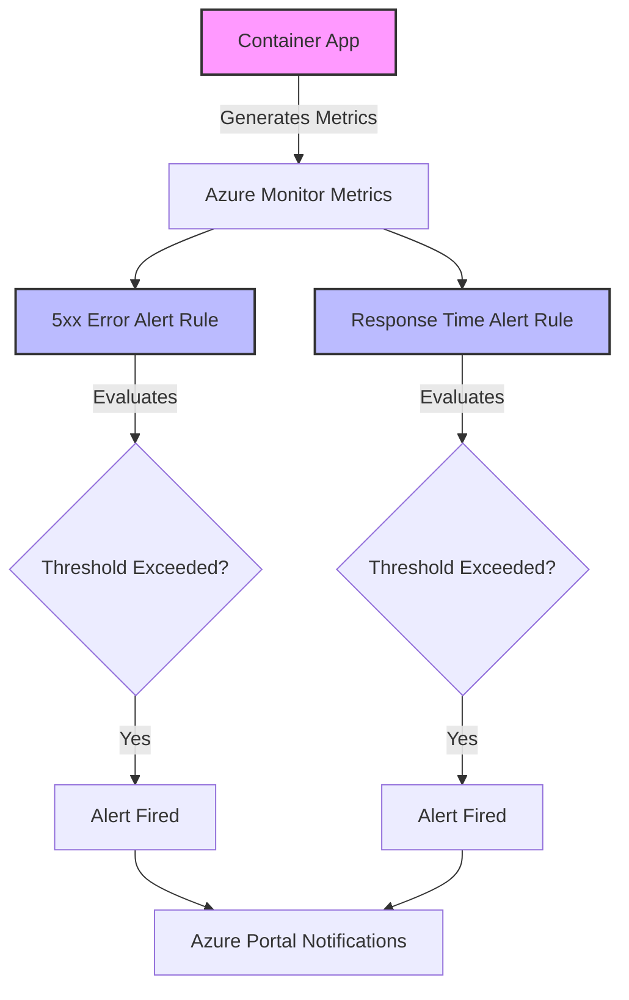
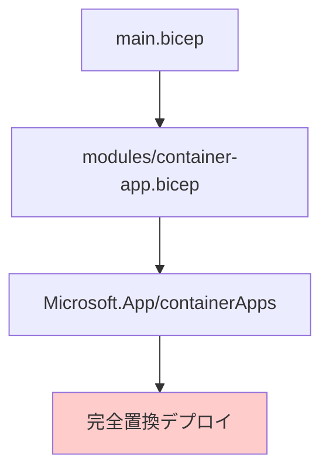
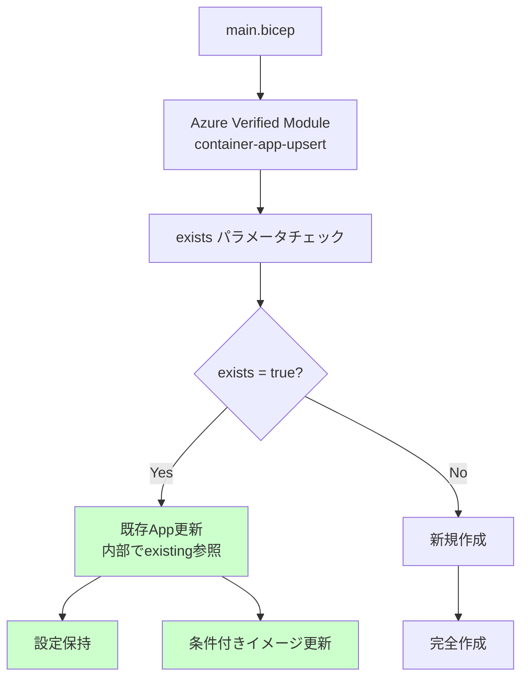
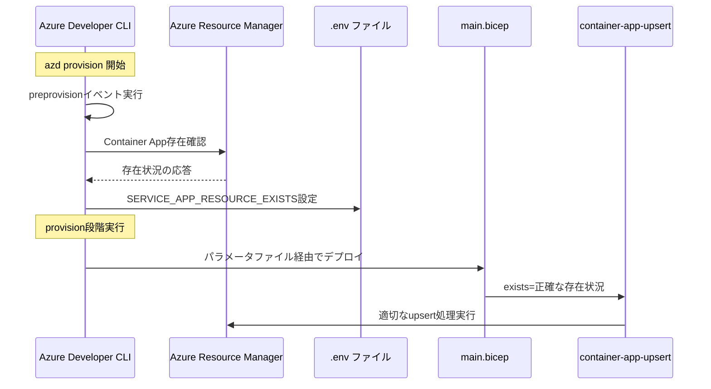
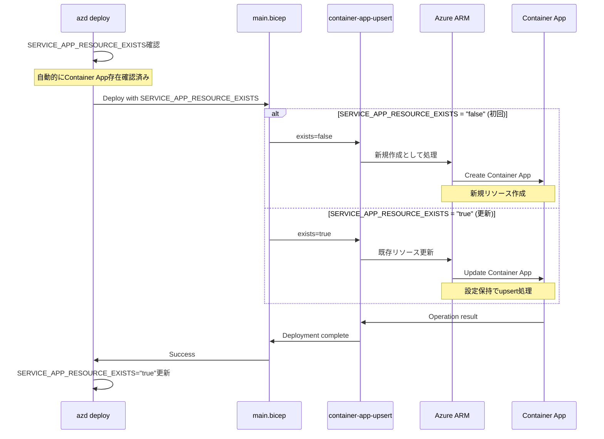
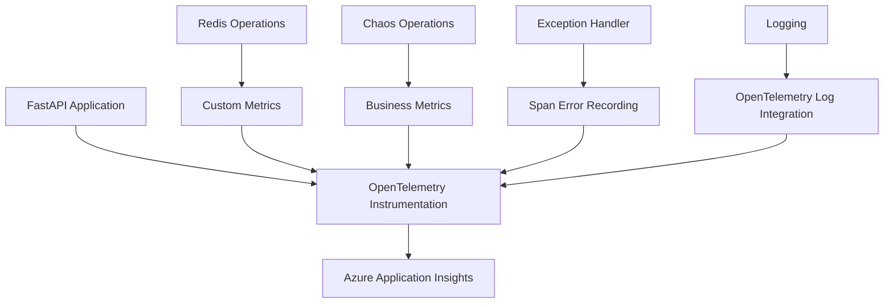
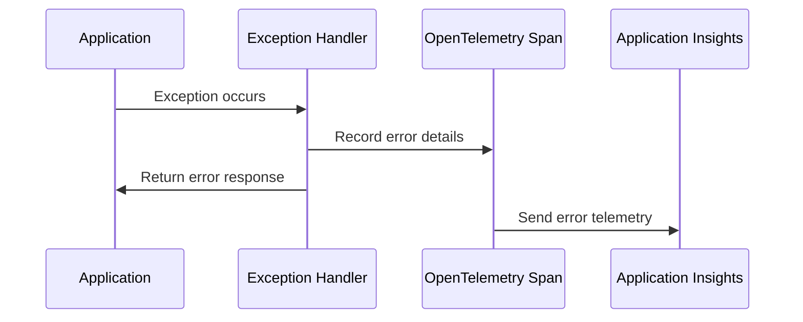

# Azure Container Apps Chaos Lab - 技術設計書

## 更新履歴
- 2025-07-25: 初版作成
- 2025-07-28: 実装に合わせて更新（サブネット構成、Redisポート、マネージドID）
- 2025-07-30: Redis接続リセット機能の設計追加
- 2025-07-30: Container Apps応答監視アラート設計追加
- 2025-07-31: OpenTelemetry実装のシンプル化
- 2025-08-01: Container App upsert戦略設計追加
- 2025-08-03: テレメトリとロギング一貫性向上設計追加

## アーキテクチャ概要

### システムコンポーネント

```
┌─────────────────────────────────────────────────────────────────┐
│                         Internet                                │
└─────────────────────────────────────────────────────────────────┘
                               │
                               ▼
┌─────────────────────────────────────────────────────────────────┐
│                    Container Apps Ingress                       │
│                        (HTTPS)                                  │
└─────────────────────────────────────────────────────────────────┘
                               │
                               ▼
┌─────────────────────────────────────────────────────────────────┐
│                        Azure VNet                               │
│  ┌──────────────────────────────────────────────────────────┐  │
│  │              Container Apps Subnet                        │  │
│  │  ┌────────────────────────────────────────────────────┐  │  │
│  │  │            Container App (Python)                   │  │  │
│  │  │  ┌──────────────────┐  ┌─────────────────────┐    │  │  │
│  │  │  │   FastAPI App     │  │  Application       │    │  │  │
│  │  │  │  - Health Check   │  │  Insights SDK      │    │  │  │
│  │  │  │  - Redis Client   │  └─────────────────────┘    │  │  │
│  │  │  │  - Chaos APIs     │                             │  │  │
│  │  │  │  - Managed ID     │                             │  │  │
│  │  │  └──────────────────┘                             │  │  │
│  │  └────────────────────────────────────────────────────┘  │  │
│  │                            │                              │  │
│  │                     NSG (動的制御)                        │  │
│  └──────────────────────────────────────────────────────────┘  │
│                               │                                 │
│  ┌──────────────────────────────────────────────────────────┐  │
│  │           Private Endpoint Subnet                         │  │
│  │  ┌────────────────────────────────────────────────────┐  │  │
│  │  │        Redis Private Endpoint                      │  │  │
│  │  └────────────────────────────────────────────────────┘  │  │
│  └──────────────────────────────────────────────────────────┘  │
└─────────────────────────────────────────────────────────────────┘
                               │
                               ▼
┌─────────────────────────────────────────────────────────────────┐
│          Azure Managed Redis (Entra ID認証)                     │
└─────────────────────────────────────────────────────────────────┘
                               │
                               ▼
┌─────────────────────────────────────────────────────────────────┐
│     Monitoring Services (Public Access)                         │
│  ┌─────────────────────┐  ┌─────────────────────────────────┐  │
│  │  Log Analytics      │  │  Application Insights           │  │
│  └─────────────────────┘  └─────────────────────────────────┘  │
└─────────────────────────────────────────────────────────────────┘

┌─────────────────────────────────────────────────────────────────┐
│              External Load Testing (Locust)                     │
│                   ┌─────────────────┐                          │
│                   │  Local Machine  │                          │
│                   └─────────────────┘                          │
└─────────────────────────────────────────────────────────────────┘
```

### ネットワーク設計

#### VNet構成
- **アドレス空間**: 10.0.0.0/16
- **Container Apps サブネット**: 10.0.1.0/24 (256 IPs)
- **Private Endpoint サブネット**: 10.0.2.0/24 (256 IPs)

#### NSG設計
- **適用対象**: Private Endpoint サブネットのみ（Container Appsサブネットには適用しない）
- **通常時ルール**:
  - デフォルトルールのみ（送信は許可）
- **障害注入時ルール**:
  - Redis向けの通信を動的にDENY（優先度100）
  - ルール名: "DenyRedisTraffic"

### 認証設計

#### Managed Identity
- Container AppにUser Assigned Managed Identityを使用
- Container Registry Pullロールを付与（AcrPull）
- Redisアクセスポリシーを付与

#### Redis Entra ID認証
- Azure Managed Redis（Redis Enterprise）を使用
- Entra ID認証を有効化（アクセスポリシー経由）
- パスワード認証は使用しない
- Container AppのManaged Identityにdefaultアクセスポリシーを付与

### データフロー

#### 正常時のフロー
```
1. クライアント → Container Apps Ingress (HTTPS)
2. Ingress → Container App
3. Container App → Entra ID (トークン取得)
4. Container App → Redis Private Endpoint (Entra IDトークンで認証)
5. Redis → Container App
6. Container App → Application Insights (テレメトリ)
7. Container App → クライアント (HTTP 200)
```

#### Redis障害時のフロー
```
1. クライアント → Container Apps Ingress (HTTPS)
2. Ingress → Container App
3. Container App → Entra ID (トークン取得)
4. Container App → Redis Private Endpoint (NSGでブロック)
5. Container App → Application Insights (エラーログ)
6. Container App → クライアント (HTTP 503)
```

#### 外部負荷テスト時のフロー
```
1. Locust → Container Apps Ingress (大量のHTTPSリクエスト)
2. Ingress → Container App (複数のレプリカに分散)
3. Container App → Redis (高頻度アクセス、Entra ID認証)
4. Container App → Application Insights (高負荷メトリクス)
5. Container App → Locust (レスポンス時間劣化)
```

#### Redis接続リセット時のフロー
```
1. クライアント → Container Apps Ingress (HTTPS)
2. Ingress → Container App
3. Container App → Redis接続プール (既存接続をクローズ)
4. Container App → Application Insights (リセットイベント記録)
5. Container App → クライアント (リセット完了応答)
6. 次回Redis操作時 → 新規接続確立
```

## インターフェース定義

### REST API仕様

#### ヘルスチェックエンドポイント
```http
GET /health
```
**レスポンス**:
```json
{
  "status": "healthy|unhealthy",
  "redis": {
    "connected": true|false,
    "latency_ms": 0
  },
  "timestamp": "2025-07-25T00:00:00Z"
}
```

#### メインエンドポイント
```http
GET /
```
**レスポンス**:
```json
{
  "message": "Hello from Container Apps Chaos Lab",
  "redis_data": "...",
  "timestamp": "2025-07-25T00:00:00Z"
}
```

#### 負荷制御エンドポイント
```http
POST /chaos/load
Content-Type: application/json

{
  "level": "low|medium|high",
  "duration_seconds": 60
}
```
**レスポンス**:
```json
{
  "status": "load_started",
  "level": "medium",
  "duration_seconds": 60
}
```

#### ハングアップエンドポイント
```http
POST /chaos/hang
Content-Type: application/json

{
  "duration_seconds": 0  // 0 = 永続的
}
```
**レスポンス**: なし（ハングアップするため）

#### Redis接続リセットエンドポイント
```http
POST /chaos/redis-reset
Content-Type: application/json

{
  "force": true|false  // オプション: 強制切断フラグ（デフォルト: true）
}
```
**レスポンス**:
```json
{
  "status": "redis_connections_reset",
  "connections_closed": 3,
  "timestamp": "2025-07-30T12:00:00Z"
}
```

#### ステータス確認エンドポイント
```http
GET /chaos/status
```
**レスポンス**:
```json
{
  "load": {
    "active": true|false,
    "level": "low|medium|high",
    "remaining_seconds": 30
  },
  "hang": {
    "active": true|false,
    "remaining_seconds": 0
  },
  "redis": {
    "connected": true|false,
    "connection_count": 3,
    "last_reset": "2025-07-30T12:00:00Z"
  }
}
```

## データモデル

### Redis データ構造
```python
# キー構造
key = "chaos_lab:{entity_type}:{entity_id}"

# 例
"chaos_lab:counter:requests" → int (リクエストカウンター)
"chaos_lab:data:sample" → JSON string (サンプルデータ)
"chaos_lab:health:last_check" → timestamp (最終ヘルスチェック時刻)
```

### アプリケーション内部状態
```python
class ChaosState:
    load_active: bool = False
    load_level: str = "low"  # low, medium, high
    load_end_time: Optional[datetime] = None
    hang_active: bool = False
    hang_end_time: Optional[datetime] = None
    redis_last_reset: Optional[datetime] = None
```

## エラー処理

### エラーマトリックス

| エラーシナリオ | HTTPステータス | エラーメッセージ | 対応 |
|--------------|--------------|----------------|-----|
| Redis接続失敗 | 503 | "Redis connection failed" | リトライ後、デグレード動作 |
| Redis認証失敗 | 503 | "Redis authentication failed" | トークン再取得、エラーログ |
| Redis タイムアウト | 503 | "Redis operation timeout" | タイムアウト値調整、エラーログ |
| 不正な負荷レベル | 400 | "Invalid load level" | 有効な値を返す |
| 内部エラー | 500 | "Internal server error" | スタックトレース記録 |
| ハングアップ中 | - | - | レスポンスなし |

### エラー処理フロー
```python
try:
    # Redis操作
    result = await redis_client.get(key)
except ConnectionError:
    # 接続エラー
    logger.error("Redis connection failed")
    return JSONResponse(
        status_code=503,
        content={"error": "Redis connection failed"}
    )
except AuthenticationError:
    # 認証エラー
    logger.error("Redis authentication failed")
    return JSONResponse(
        status_code=503,
        content={"error": "Redis authentication failed"}
    )
except TimeoutError:
    # タイムアウト
    logger.error("Redis operation timeout")
    return JSONResponse(
        status_code=503,
        content={"error": "Redis operation timeout"}
    )
except Exception as e:
    # その他のエラー
    logger.exception("Unexpected error")
    return JSONResponse(
        status_code=500,
        content={"error": "Internal server error"}
    )
```

## 単体テスト戦略

### テストカバレッジ目標
- コードカバレッジ: 80%以上
- 主要パスのカバレッジ: 100%

### テスト対象
1. **API エンドポイント**
   - 正常系レスポンス
   - エラーレスポンス
   - バリデーション

2. **Redis 操作**
   - Entra ID認証
   - 接続/切断
   - データ読み書き
   - エラーハンドリング

3. **負荷シミュレーション**
   - CPU負荷生成
   - メモリ負荷生成
   - タイマー動作

4. **ハングアップ機能**
   - 永続的ハング
   - 時限的ハング
   - 状態管理

5. **Redis接続リセット機能**
   - 接続プールの切断
   - 接続状態の確認
   - 自動再接続

### モックストラテジー
- Redis接続: AsyncMockを使用したカスタムモック
- Entra ID認証: azure-identityのDefaultAzureCredentialをモック
- 時刻: asyncio.sleepのモック
- HTTPクライアント: httpxのAsyncClientモック

## セキュリティ考慮事項

### ネットワークセキュリティ
- Container AppsはVNet統合で外部直接アクセスを防止
- RedisはPrivate Endpointのみでアクセス可能
- NSGで最小権限の原則を適用

### アプリケーションセキュリティ
- Managed Identityで認証（パスワード不要）
- 環境変数に機密情報を保存しない
- エラーメッセージに機密情報を含めない
- 入力値の適切なバリデーション

### 監視セキュリティ
- Application InsightsとLog Analyticsはパブリックアクセス（設計制約）
- 監視データに機密情報を含めない
- 適切なRBACの設定

## パフォーマンス考慮事項

### スケーリング設計
- Container Apps自動スケーリング設定
  - 最小レプリカ: 1
  - 最大レプリカ: 10
  - スケールルール: CPU使用率70%

### Redis接続プール
- 接続プール管理: redis-pyの自動管理
- 接続ポート: 10000（Azure Managed Redisのデフォルト）
- SSL/TLS: 有効（必須）
- トークンキャッシュ: DefaultAzureCredentialによる自動管理

### 負荷特性
- **アプリケーション内部負荷**:
  - 低負荷: CPU 20-30%、メモリ 100MB
  - 中負荷: CPU 50-60%、メモリ 500MB
  - 高負荷: CPU 80-90%、メモリ 1GB
- **外部負荷（Locust）**:
  - 段階的増加: 10→100→1000 users/秒
  - スパイク: 0→5000 users（瞬時）
  - 持続負荷: 500 users×10分間

## 技術スタック

### インフラストラクチャー
- **IaC**: Bicep
- **環境管理**: Azure Developer CLI (azd)
- **CI/CD**: GitHub Actions (将来的な拡張用)

### アプリケーション
- **言語**: Python 3.13
- **Webフレームワーク**: FastAPI
- **非同期処理**: asyncio
- **Redisクライアント**: redis (v6.2.0) + azure-identity
- **監視**: Azure Monitor OpenTelemetry (v1.6.12) - 自動計装使用
- **パッケージ管理**: uv (開発環境のみ)

### 開発ツール
- **テストフレームワーク**: pytest, pytest-asyncio
- **負荷テスト**: Locust
- **コード品質**: ruff (linting & formatting)
- **型チェック**: mypy
- **依存管理**: uv, pyproject.toml
- **JSON処理**: jq (スクリプトでのJSON操作)

## デプロイメントアーキテクチャ

### Azure Developer CLI構成
```
aca-chaos-lab/
├── azure.yaml          # azd設定
├── infra/             # Bicepテンプレート
│   ├── main.bicep     # メインテンプレート
│   ├── main.parameters.json
│   └── modules/       # Bicepモジュール
├── src/               # アプリケーションコード
│   ├── app/           # FastAPIアプリ
│   ├── Dockerfile     # 本番用Dockerfile
│   ├── pyproject.toml # uv設定（開発用）
│   └── requirements.txt # pip用（本番用）
├── tests/             # テストコード
│   └── locust/        # Locustシナリオ
└── scripts/           # 運用スクリプト
    ├── inject-network-failure.sh
    ├── clear-network-failures.sh
    ├── list-network-failures.sh
    ├── inject-deployment-failure.sh
    ├── list-revisions.sh
    └── azd-env-helper.sh
```

### 環境変数設計
```bash
# Redis接続
REDIS_HOST=<redis-name>.redis.azure.net
REDIS_PORT=10000
REDIS_SSL=true
# パスワードは不要（Entra ID認証）

# Application Insights
APPLICATIONINSIGHTS_CONNECTION_STRING=<connection-string>

# アプリケーション設定
APP_PORT=8000
LOG_LEVEL=INFO

# Azure環境
AZURE_CLIENT_ID=<managed-identity-client-id>
# AZURE_TENANT_IDは不要（DefaultAzureCredentialが自動検出）
```

### 開発環境でのuv使用

#### pyproject.toml
```toml
[project]
name = "aca-chaos-lab"
version = "0.1.0"
description = "Azure Container Apps Chaos Lab"
requires-python = ">=3.13"
dependencies = [
    "fastapi>=0.109.0",
    "uvicorn>=0.27.0",
    "redis>=5.0.0",
    "azure-identity>=1.15.0",
    "azure-monitor-opentelemetry>=1.2.0",
    "pydantic>=2.5.0",
    "httpx>=0.26.0",
]

[project.optional-dependencies]
dev = [
    "pytest>=7.4.0",
    "pytest-asyncio>=0.23.0",
    "ruff>=0.1.0",
    "mypy>=1.8.0",
    "locust>=2.20.0",
]

[tool.ruff]
line-length = 88
target-version = "py313"

[tool.ruff.lint]
select = ["E", "F", "I", "N", "UP", "ASYNC", "S", "B", "A", "C4", "T20", "SIM"]
ignore = ["E501"]

[tool.mypy]
python_version = "3.13"
warn_return_any = true
warn_unused_configs = true
ignore_missing_imports = true
```

#### 開発ワークフロー
```bash
# 開発環境のセットアップ
uv venv
source .venv/bin/activate  # Linux/Mac
# or
.venv\Scripts\activate  # Windows

# 依存関係のインストール
uv pip install -e ".[dev]"

# requirements.txtの生成（本番用）
uv pip compile pyproject.toml -o requirements.txt
```

#### Dockerfile（本番用）
```dockerfile
FROM python:3.13-slim

WORKDIR /app

# 依存関係のインストール
COPY requirements.txt .
RUN pip install --no-cache-dir -r requirements.txt

# アプリケーションのコピー
COPY ./app ./app

# ポート設定
EXPOSE 8000

# 実行
CMD ["uvicorn", "app.main:app", "--host", "0.0.0.0", "--port", "8000"]
```

### Redis Entra ID認証の実装

#### 概要

本アプリケーションでは、redis-pyライブラリの標準的な機能を活用し、Azure Managed Redis（Redis Enterprise）への接続を実装しています。主な特徴：

- **Entra ID認証**: DefaultAzureCredentialを使用したパスワードレス認証
- **接続プール管理**: redis-pyの内部接続プールによる効率的な接続管理
- **標準的なリトライ機構**: redis-pyのRetry/ExponentialBackoffを使用
- **自動再接続**: 接続エラー時の自動的な再接続処理

#### 接続管理の詳細

##### 1. 起動時の接続処理

```python
# アプリケーション起動時（lifespan内）
if settings.redis_enabled:
    redis_client = RedisClient(settings.redis_host, settings.redis_port, settings)
    try:
        await redis_client.connect()
        logger.info("Successfully connected to Redis at startup")
    except Exception as e:
        logger.warning(f"Failed to connect to Redis at startup: {e}")
        logger.info("Redis connection will be retried on first use")
        # 起動は継続 - 最初の操作時に再接続を試行
```

**設計方針**:
- 起動時の接続エラーでアプリケーションを停止させない
- 設定ミスなど恒久的な問題は運用時に検知・修正
- 一時的なネットワーク問題には自動的に対応

##### 2. リトライメカニズム

```python
# redis-pyの標準的なリトライ設定
retry_strategy = Retry(
    backoff=ExponentialBackoff(base=backoff_base, cap=backoff_cap),
    retries=max_retries
)

self.client = await redis.from_url(
    f"rediss://{self.host}:{self.port}",
    username=client_id,
    password=token,
    retry=retry_strategy,
    retry_on_error=[redis.ConnectionError, redis.TimeoutError],
    health_check_interval=30,
)
```

**デフォルト設定**:
- 最大リトライ回数: 1回
- 指数バックオフ: 1秒ベース、3秒上限
- ヘルスチェック間隔: 30秒
- 対象エラー: ConnectionError, TimeoutError

##### 3. 接続プール管理

```python
# 接続プール設定
max_connections=50  # 最大接続数
socket_timeout=3    # ソケットタイムアウト（秒）
socket_connect_timeout=3  # 接続タイムアウト（秒）
```

**接続プールの動作**:
- redis-pyが内部的に接続プールを管理
- 接続の再利用により効率的なリソース使用
- 自動的な接続の作成・破棄
- ヘルスチェックによる不正な接続の検出・削除

##### 4. 接続リセット機能

```python
async def reset_connections(self) -> int:
    """Reset all Redis connections."""
    async with self._connection_lock:
        if self.client and hasattr(self.client, "connection_pool"):
            # 接続プールのdisconnect()メソッドを使用
            # これは標準的な接続リセット方法
            closed_count = await pool.disconnect()
            self._connection_count = 0
            return closed_count
```

**リセット機能の特徴**:
- 接続プールの`disconnect()`メソッドを使用（標準的な方法）
- すべての既存接続を切断
- 次回操作時に自動的に新規接続を確立
- カオステスト用APIから呼び出し可能

#### エラーハンドリング

##### 1. 起動時のエラー

```python
# 起動時: エラーでも継続
try:
    await redis_client.connect()
except Exception as e:
    logger.warning(f"Failed to connect to Redis at startup: {e}")
    # アプリケーションは起動を継続
```

##### 2. 実行時のエラー

```python
# 実行時: redis-pyがリトライを実行
try:
    redis_data = await redis_client.get(key)
except Exception as e:
    # リトライ後も失敗した場合
    logger.error(f"Redis operation failed: {e}")
    # HTTPステータス503を返す
    return JSONResponse(status_code=503, ...)
```

##### 3. 接続リセット後の動作

```python
# リセット後: 自動再接続
1. /chaos/redis-reset APIを呼び出し
2. 既存の接続をすべて切断
3. 次のRedis操作で自動的に新規接続を確立
4. 一時的にエラーが発生する可能性があるが自動回復
```

#### 環境変数による設定

| 変数名 | 説明 | デフォルト値 |
|--------|------|------------|
| `REDIS_ENABLED` | Redis接続を有効化 | true |
| `REDIS_SSL` | Redis SSL接続を有効化 | true |
| `REDIS_MAX_CONNECTIONS` | 接続プール最大接続数 | 50 |
| `REDIS_SOCKET_TIMEOUT` | ソケットタイムアウト（秒） | 3 |
| `REDIS_SOCKET_CONNECT_TIMEOUT` | 接続タイムアウト（秒） | 3 |
| `REDIS_MAX_RETRIES` | 最大リトライ回数 | 1 |
| `REDIS_BACKOFF_BASE` | 指数バックオフベース時間（秒） | 1 |
| `REDIS_BACKOFF_CAP` | 指数バックオフ最大時間（秒） | 3 |

## Locust負荷テスト設計

### テストシナリオ
1. **段階的負荷増加シナリオ**
   ```python
   # 10分かけて0→1000ユーザーまで増加
   stages = [
       {"duration": 120, "users": 100, "spawn_rate": 10},
       {"duration": 180, "users": 500, "spawn_rate": 50},
       {"duration": 300, "users": 1000, "spawn_rate": 100}
   ]
   ```

2. **スパイク負荷シナリオ**
   ```python
   # 瞬時に5000ユーザーを投入
   stages = [
       {"duration": 10, "users": 5000, "spawn_rate": 500},
       {"duration": 60, "users": 5000, "spawn_rate": 0},
       {"duration": 10, "users": 0, "spawn_rate": 500}
   ]
   ```

3. **持続負荷シナリオ**
   ```python
   # 500ユーザーで10分間継続
   stages = [
       {"duration": 30, "users": 500, "spawn_rate": 50},
       {"duration": 600, "users": 500, "spawn_rate": 0}
   ]
   ```

### テストエンドポイント
- メインページ（GET /）
- ヘルスチェック（GET /health）
- Redis読み書き操作を含むAPI


### OpenTelemetry実装（2025-08-03更新）

#### 概要

Azure Monitor OpenTelemetryの標準サンプリング機能と最適化されたRedisアクセスパターンを実装：

- **標準サンプリング**: `OTEL_TRACES_SAMPLER=traceidratio`環境変数による10%サンプリング
- **自動計装**: FastAPIは自動的に計装され、手動のspan作成は不要
- **Redis最適化**: ヘルスチェックキャッシュとリクエストカウンター削減によるパフォーマンス向上
- **コスト最適化**: 負荷テスト時のテレメトリコストを90%削減

#### 実装詳細

```python
# telemetry.py - 標準OpenTelemetryサンプリング
def setup_telemetry(app=None):
    """Configure Azure Application Insights telemetry with OpenTelemetry standard sampling."""
    sampling_rate = float(os.getenv("OTEL_TRACES_SAMPLER_ARG", "0.1"))
    
    # Set OpenTelemetry standard environment variables for sampling
    if "OTEL_TRACES_SAMPLER" not in os.environ:
        os.environ["OTEL_TRACES_SAMPLER"] = "traceidratio"
        os.environ["OTEL_TRACES_SAMPLER_ARG"] = str(sampling_rate)
    
    # Configure Azure Monitor (respects OTEL environment variables)
    configure_azure_monitor(
        connection_string=connection_string,
        logger_name="aca-chaos-lab",
        resource=resource,
    )
    
    # Instrument FastAPI with health check exclusion
    if app:
        FastAPIInstrumentor.instrument_app(
            app,
            excluded_urls="health",
        )
    
    # Redis instrumentation
    RedisInstrumentor().instrument()
```

#### Redis最適化

```python
# main.py - ヘルスチェックキャッシュ（5秒TTL）
_HEALTH_CACHE_TTL = 5.0  # seconds

def _is_health_cache_valid() -> bool:
    """Check if cached health status is still valid."""
    if _health_cache.get("timestamp") is None:
        return False
    
    current_time = asyncio.get_event_loop().time()
    return (current_time - _health_cache["timestamp"]) < _HEALTH_CACHE_TTL

# Redis optimization: Only increment counter for ~10% of requests to reduce load
# This represents a 90% reduction in Redis operations for request counting
if hash(timestamp[:19]) % 10 == 0:  # ~10% of requests
    await redis_client.increment("chaos_lab:counter:requests")
```

#### パフォーマンス改善

- **テレメトリサンプリング**: 標準10%サンプリングでコスト最適化
- **ヘルスチェック**: 5秒キャッシュでRedis PING頻度を大幅削減
- **リクエストカウンター**: 90%削減により不要なRedis操作を削除
- **コード品質**: 手動span管理削除によりコードの保守性向上

#### 削減された複雑性

- 手動のspan作成コードを削除
- グローバルtracer変数を削除
- 不要なinstrumentation optionsを削除
- カスタムトレーサーの作成を削除
- コード量を約50%削減（73行→36行）

## 実装状況（2025-07-31）

すべての機能が実装済みで、本番環境で稼働中：

1. **基本インフラ** ✅
   - VNet、サブネット、NSG
   - Container Apps Environment（VNet統合）
   - Azure Managed Redis（Redis Enterprise）with Private Endpoint
   - User Assigned Managed Identity

2. **基本アプリケーション** ✅
   - FastAPIベースのWebアプリ
   - Redis接続とヘルスチェック（Entra ID認証）
   - Azure Monitor OpenTelemetry統合

3. **障害注入機能** ✅
   - NSGルール操作スクリプト（azd環境変数対応）
   - 負荷シミュレーションAPI（/chaos/load）
   - ハングアップAPI（/chaos/hang）
   - ステータス確認API（/chaos/status）

4. **負荷テストツール** ✅
   - Locustテストシナリオ（baseline、stress、spike、chaos）
   - 負荷テスト実行スクリプト
   - 結果分析とレポート生成

5. **運用ツール** ✅
   - Application Insightsダッシュボード
   - 包括的なドキュメント
   - Azure Developer CLI統合

6. **Redis接続リセット機能** ✅ (2025-07-30追加)
   - Redis接続リセットAPI（/chaos/redis-reset）
   - 接続プールの標準的なdisconnect()メソッドを使用
   - 自動再接続機能
   - ネットワーク障害スクリプトとの統合

## Container Apps応答監視アラート設計

### アラートアーキテクチャ



### アラートルール仕様

#### 1. 5xx系エラーアラート

```bicep
resource alert5xxStatusCodes 'Microsoft.Insights/metricAlerts@2018-03-01' = {
  name: '${containerAppName}-5xx-alerts'
  location: 'global'
  properties: {
    severity: 2
    enabled: true
    scopes: [containerAppResourceId]
    evaluationFrequency: 'PT1M'
    windowSize: 'PT5M'
    criteria: {
      'odata.type': 'Microsoft.Azure.Monitor.SingleResourceMultipleMetricCriteria'
      allOf: [{
        name: 'HTTP5xxErrors'
        metricName: 'Requests'
        metricNamespace: 'Microsoft.App/containerApps'
        dimensions: [{
          name: 'StatusCodeCategory'
          operator: 'Include'
          values: ['5xx']
        }]
        operator: 'GreaterThan'
        threshold: 5
        timeAggregation: 'Count'
        criterionType: 'StaticThresholdCriterion'
      }]
    }
    autoMitigate: true
  }
}
```

**設計ポイント**:
- メトリクス: Container Appsの標準メトリクス「Requests」
- フィルタ: StatusCodeCategoryディメンションで5xxをフィルタリング
- 閾値: 5分間で5回以上の5xxエラー
- 評価頻度: 1分ごと
- 重要度: 2（警告レベル）

#### 2. 応答時間アラート

```bicep
resource alertResponseTime 'Microsoft.Insights/metricAlerts@2018-03-01' = {
  name: '${containerAppName}-response-time-alerts'
  location: 'global'
  properties: {
    severity: 2
    enabled: true
    scopes: [containerAppResourceId]
    evaluationFrequency: 'PT1M'
    windowSize: 'PT5M'
    criteria: {
      'odata.type': 'Microsoft.Azure.Monitor.SingleResourceMultipleMetricCriteria'
      allOf: [{
        name: 'HighResponseTime'
        metricName: 'ResponseTime'
        metricNamespace: 'Microsoft.App/containerApps'
        operator: 'GreaterThan'
        threshold: 5000
        timeAggregation: 'Average'
        criterionType: 'StaticThresholdCriterion'
      }]
    }
    autoMitigate: true
  }
}
```

**設計ポイント**:
- メトリクス: Container Appsの標準メトリクス「ResponseTime」
- 閾値: 平均応答時間5000ミリ秒（5秒）
- 集計方法: 5分間の平均値
- 評価頻度: 1分ごと
- 重要度: 2（警告レベル）

### Bicepモジュール統合

#### alert-rules.bicep

```bicep
param location string
param tags object
param containerAppName string

// Container Appリソースの参照
resource containerApp 'Microsoft.App/containerApps@2025-01-01' existing = {
  name: containerAppName
}

// 5xxエラーアラートルール
resource alert5xxStatusCodes 'Microsoft.Insights/metricAlerts@2018-03-01' = {
  // ... 上記の定義
}

// 応答時間アラートルール
resource alertResponseTime 'Microsoft.Insights/metricAlerts@2018-03-01' = {
  // ... 上記の定義
}

output alert5xxId string = alert5xxStatusCodes.id
output alertResponseTimeId string = alertResponseTime.id
```

#### main.bicepへの統合

```bicep
// 既存のモジュール定義...

module alertRules './modules/alert-rules.bicep' = {
  name: 'alert-rules'
  scope: resourceGroup
  params: {
    location: location
    tags: tags
    containerAppName: containerApp.outputs.containerAppName
  }
  dependsOn: [
    containerApp
  ]
}

// 新しい出力の追加
output AZURE_ALERT_5XX_ID string = alertRules.outputs.alert5xxId
output AZURE_ALERT_RESPONSE_TIME_ID string = alertRules.outputs.alertResponseTimeId
```

### 実装考慮事項

1. **アクショングループ**:
   - 現時点では定義しない（ユーザー要件）
   - 将来的にメール、SMS、Webhook通知を追加可能

2. **アラートの調整**:
   - 閾値は環境に応じて調整可能
   - 評価頻度とウィンドウサイズの最適化

3. **監視の拡張性**:
   - 追加のメトリクスアラート（CPU、メモリ使用率など）
   - カスタムメトリクスの追加

4. **コスト考慮**:
   - メトリクスアラートは低コスト
   - 評価頻度の調整でコスト最適化可能

## Container App Upsert戦略設計

### 概要

Azure Developer CLIでのContainer Appsデプロイにおいて、Azure Verified Module（AVM）の`container-app-upsert`パターンを採用する。これにより、インクリメンタル更新と設定保持を実現する。

### 現在のアーキテクチャとの比較

#### 現在の方式


#### upsert戦略方式


### upsert戦略のメリットと実装方針

1. **ダウンタイム削減**: Container App全体を置換せずに必要な部分のみ更新
2. **設定保持**: 明示的に変更しない設定値を保持
3. **条件付き更新**: イメージが指定されていない場合は既存イメージを維持
4. **Azure推奨**: Microsoftが公式に推奨するベストプラクティス

### existsパラメータの正しい理解

**重要**: `exists`パラメータの値は、Azure Developer CLIがprovision実行前に自動判定します。

#### Azure Developer CLI の自動存在確認メカニズム

Azure Developer CLI は以下の動作を自動実行します：

1. **preprovisionイベント**: `azd provision` 開始前にトリガー
2. **リソース存在確認**: Container Appの存在をAzure Resource Managerに問い合わせ  
3. **環境変数設定**: 結果を `SERVICE_APP_RESOURCE_EXISTS` に自動設定
4. **パラメータ渡し**: Bicepテンプレートに正確な存在状態を渡す

この仕組みにより、開発者が手動で存在状態を管理する必要がなく、Azure Developer CLIが全自動で適切なupsert戦略を選択します。

#### 実際の動作フロー



#### Microsoftサンプルでの実装例

```bicep
// Azure-Samples/todo-nodejs-mongo-aca より
module api 'br/public:avm/ptn/azd/container-app-upsert:0.1.1' = {
  name: 'api-container-app'
  params: {
    name: '${abbrs.appContainerApps}api-${resourceToken}'
    exists: apiAppExists  // パラメータで明示的に指定
    // その他のパラメータ...
  }
}
```

#### パラメータファイルでの制御

```json
// main.parameters.json
{
  "containerAppExists": {
    "value": "${SERVICE_APP_RESOURCE_EXISTS:false}"  // azdが自動設定
  }
}
```

#### 実装戦略の実際

Azure Developer CLI の自動管理により以下が実現されます：

1. **初回デプロイ**: 
   - Container App未存在 → `SERVICE_APP_RESOURCE_EXISTS="false"`
   - 新規作成として処理
   
2. **更新デプロイ**: 
   - Container App存在 → `SERVICE_APP_RESOURCE_EXISTS="true"`
   - upsert（設定保持）として処理

3. **環境変数による制御**:
   - 通常は手動設定不要
   - 特殊な場合のみ `azd env set SERVICE_APP_RESOURCE_EXISTS true`

### デプロイフロー（正確版）



### パラメータマッピング

| 現在のパラメータ | AVMパラメータ | 変更点 |
|------------------|---------------|--------|
| `containerAppName` | `name` | 直接マッピング |
| `containerImage` | `imageName` | 条件付きロジック追加 |
| `containerAppsEnvironmentName` | `containerAppsEnvironmentName` | 直接マッピング |
| `redisHost` 等の環境変数 | `env[]` | 配列形式に変更 |
| `managedIdentityName` | `managedIdentityName` | 直接マッピング |
| ヘルスプローブ設定 | `probes[]` | 配列形式に変更 |

### 実装アプローチ（修正版）

#### 1. 推奨実装（シンプル戦略）

```bicep
module containerApp 'br/public:avm/ptn/azd/container-app-upsert:0.1.2' = {
  name: 'container-app'
  scope: resourceGroup
  params: {
    name: '${abbrs.appContainerApps}app-${resourceToken}'
    // 常にfalseでupsert動作を活用
    exists: false
    imageName: !empty(containerAppImageName) ? containerAppImageName : ''
    // その他のパラメータ
  }
}
```

**利点**:
- シンプルで理解しやすい
- Azure Developer CLIの標準的な使用方法
- 初回デプロイと更新デプロイで同じテンプレートが使用可能

#### 2. 高度な制御（必要に応じて）

```bicep
@description('Specifies if the container app already exists')
param appExists bool = false

module containerApp 'br/public:avm/ptn/azd/container-app-upsert:0.1.2' = {
  name: 'container-app'
  params: {
    exists: appExists  // 環境変数やパラメータで制御
    // その他のパラメータ
  }
}
```

**制御方法**:
```bash
# 新規デプロイ
azd deploy  # exists=false（デフォルト）

# 更新デプロイ（必要に応じて）
azd env set APP_EXISTS true
azd deploy
```

### 移行への推奨アプローチ

#### 現在の実装の正確性確認

現在の実装は既に正しく動作しており、Azure Developer CLI の標準的な動作パターンです：

1. **自動管理**: Azure Developer CLI がリソース存在を自動確認
2. **正確な制御**: `SERVICE_APP_RESOURCE_EXISTS` で適切なupsert戦略を実行
3. **Microsoft準拠**: 公式の命名規則と動作パターンに一致

#### main.bicepの最終実装

```bicep
module containerApp 'br/public:avm/ptn/azd/container-app-upsert:0.1.2' = {
  name: 'container-app'
  scope: resourceGroup
  params: {
    name: '${abbrs.appContainerApps}app-${resourceToken}'
    location: location
    tags: union(tags, { 'azd-service-name': 'app' })
    containerAppsEnvironmentName: containerAppsEnvironment.outputs.environmentName
    containerRegistryName: containerRegistry.outputs.registryName
    imageName: !empty(containerAppImageName) ? containerAppImageName : ''
    exists: containerAppExists // Azure Developer CLIが自動判定した結果
    identityType: 'UserAssigned'
    identityName: managedIdentity.outputs.managedIdentityName
    identityPrincipalId: managedIdentity.outputs.managedIdentityPrincipalId
    userAssignedIdentityResourceId: managedIdentity.outputs.managedIdentityId
    // 環境変数とその他の設定...
  }
}
```

#### 動作の確認方法

1. **初回デプロイ**: `azd up` - Azure Developer CLI が自動的に新規作成を認識
2. **更新デプロイ**: `azd deploy` - Azure Developer CLI が既存リソースを認識してupsert実行
3. **イメージ更新**: 新しいイメージをビルド後 `azd deploy` - 設定保持で更新

すべてのケースで Azure Developer CLI が適切な `SERVICE_APP_RESOURCE_EXISTS` 値を設定し、内部的に最適なupsert処理が実行されます。

## テレメトリとロギング一貫性向上設計

### 目的
OpenTelemetryを活用したテレメトリとロギングの一貫性を向上し、SREエージェントによる自動検出・診断を支援する。

### アーキテクチャ



### 実装コンポーネント

#### 1. 統一的な例外処理（REQ-TEL-001）
**目的**: 未処理例外時にOpenTelemetryのスパンにエラー情報を記録

**実装場所**: 
- `app/main.py` - グローバル例外ハンドラー
- `app/telemetry.py` - スパンエラー記録ヘルパー

**データフロー**:


#### 2. ビジネスメトリクス（REQ-TEL-002）
**目的**: Redis接続状態とカオス機能の実行状況をカスタムメトリクスとして送信

**実装場所**: 
- `app/redis_client.py` - Redis接続メトリクス
- `app/chaos.py` - カオス実行メトリクス
- `app/telemetry.py` - メトリクス送信ヘルパー

**メトリクス定義**:
- `redis_connection_status` (gauge): Redis接続状態 (0/1)
- `redis_connection_latency_ms` (histogram): Redis応答時間
- `chaos_operation_active` (gauge): アクティブなカオス操作数
- `chaos_operation_duration_seconds` (histogram): カオス操作実行時間

#### 3. ログレベルの一貫性（REQ-TEL-003）
**目的**: OpenTelemetryのログ計装設定と一致するログレベルを使用

**実装場所**: 
- `app/telemetry.py` - 統一ログ設定
- `app/config.py` - 設定管理

### エラー処理マトリクス

| エラータイプ | ログレベル | テレメトリ送信 | スパン状態 | 期待される応答 |
|-------------|-----------|---------------|-----------|---------------|
| Redis接続失敗 | ERROR | カスタムメトリクス | ERROR | 503 Service Unavailable |
| 認証失敗 | ERROR | エラースパン | ERROR | 503 Service Unavailable |
| タイムアウト | WARNING | カスタムメトリクス | ERROR | 503 Service Unavailable |
| 未処理例外 | ERROR | エラースパン + ログ | ERROR | 500 Internal Server Error |
| カオス操作失敗 | ERROR | ビジネスメトリクス | ERROR | 500 Internal Server Error |

### インターフェース定義

#### テレメトリヘルパー関数
```python
# app/telemetry.py
def record_span_error(exc: Exception, span_name: str = None) -> None
def record_redis_metrics(connected: bool, latency_ms: int) -> None
def record_chaos_metrics(operation: str, active: bool, duration_seconds: float = None) -> None
```

#### 設定拡張
```python
# app/config.py
class Settings:
    # 既存設定...
    
    # テレメトリ設定
    telemetry_enabled: bool = True
    custom_metrics_enabled: bool = True
    log_telemetry_integration: bool = True
```

### 単体テスト戦略

#### テストカテゴリ
1. **メトリクス送信テスト**: カスタムメトリクスが正しく送信されることを確認
2. **スパンエラー記録テスト**: 例外時にスパンが適切にマークされることを確認
3. **ログ統合テスト**: ログとテレメトリの連携を確認
4. **設定テスト**: 各設定値での動作を確認

#### モックとスタブ
- OpenTelemetryトレーサーのモック
- Azure Monitor エクスポーターのスタブ
- Redis接続のモック
- 例外シナリオのシミュレーション
