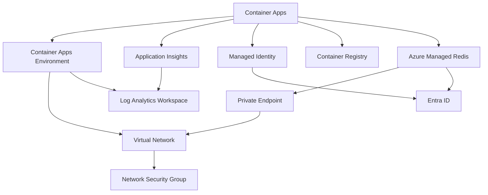
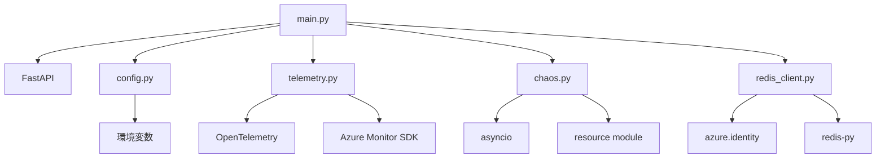
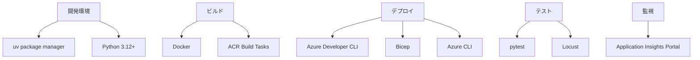

### 分析 - 依存関係と制約の特定 - 2025-07-30
**目的**: システムの依存関係グラフとリスク、制約を包括的に文書化する
**コンテキスト**: プロジェクトの構造分析とEARS記法要件定義が完了
**決定**: すべての技術的、運用的、ビジネス的依存関係を特定し、リスクと緩和戦略を文書化
**実行**: 依存関係グラフの作成と制約のカタログ化

## 依存関係グラフ

### Azureサービス依存関係

### アプリケーション内部依存関係

### 開発・運用ツール依存関係

## 技術的依存関係と制約

### 1. Azure Platform依存関係
**依存関係**: Azure Container Apps、Azure Managed Redis、Entra ID
**リスク**: 
- Azureサービスの停止やAPI変更
- リージョン固有の機能制限
- サービスクォータ制限
**緩和戦略**:
- 複数リージョンでのテスト環境構築
- Azureサービスの更新情報の定期確認
- クォータ監視とアラート設定

### 2. ネットワーキング依存関係
**依存関係**: VNet統合、プライベートエンドポイント、NSG
**リスク**:
- NSGルールの競合や誤設定
- プライベートエンドポイントのDNS解決問題
- Container Apps環境のネットワーク制約
**緩和戦略**:
- NSGルールの自動検証スクリプト
- DNS設定の文書化と検証手順
- ネットワーク設定のInfrastructure as Code化

### 3. 認証・認可依存関係
**依存関係**: Entra ID、マネージドアイデンティティ
**リスク**:
- トークン有効期限切れ
- 権限不足によるアクセス拒否
- Entra IDテナントの設定変更
**緩和戦略**:
- トークン自動更新の実装（実装済み）
- 最小権限の原則に基づくロール割り当て
- 認証フローの包括的なエラーハンドリング

### 4. 開発ツール依存関係
**依存関係**: Python 3.12+、uv、Docker
**リスク**:
- Pythonバージョンの非互換性
- パッケージ依存関係の競合
- Dockerイメージサイズの肥大化
**緩和戦略**:
- pyproject.tomlでの厳密なバージョン管理
- マルチステージDockerビルドの使用
- 定期的な依存関係更新とテスト

### 5. 監視・可観測性依存関係
**依存関係**: Application Insights、OpenTelemetry
**リスク**:
- テレメトリデータの欠落
- 高いデータ収集コスト
- パフォーマンスへの影響
**緩和戦略**:
- サンプリングレートの適切な設定
- カスタムメトリクスの選択的実装
- ローカル開発環境での監視無効化オプション

## ビジネス・運用制約

### 1. コスト制約
**制約**: Azure リソースの利用コスト
**影響**:
- Container Apps、Redis、Application Insightsの継続的な料金
- 負荷テスト時のリソース使用量増加
**対策**:
- 開発/テスト環境の自動停止
- リソースサイズの最適化
- コスト監視とアラート設定

### 2. セキュリティ制約
**制約**: パスワードレス認証の強制、プライベート通信
**影響**:
- 開発環境のセットアップ複雑化
- デバッグの困難性増加
**対策**:
- ローカル開発用の簡略化オプション（REDIS_ENABLED=false）
- セキュリティベストプラクティスの文書化
- 自動セキュリティスキャン

### 3. パフォーマンス制約
**制約**: Container Appsのリソース制限、Redisの接続数制限
**影響**:
- 大規模負荷テストの制限
- 同時接続数の上限
**対策**:
- 段階的な負荷増加シナリオ
- 接続プーリングの実装
- リソース使用状況の監視

### 4. 開発プロセス制約
**制約**: Azure Developer CLI使用の強制、Bicepによるインフラ定義
**影響**:
- 学習曲線
- ツールチェーンの統一性要求
**対策**:
- 包括的なドキュメンテーション
- サンプルコマンドとスクリプト
- トラブルシューティングガイド

## リスクマトリックス

| リスク | 可能性 | 影響度 | 緩和戦略 |
|--------|--------|--------|----------|
| Azureサービス停止 | 低 | 高 | マルチリージョン対応、バックアップ計画 |
| 認証トークン期限切れ | 中 | 中 | 自動更新実装、エラーハンドリング |
| NSG設定ミス | 中 | 高 | 自動検証、ロールバック機能 |
| 依存パッケージ競合 | 中 | 中 | バージョン固定、定期更新 |
| コスト超過 | 中 | 中 | 監視アラート、自動停止 |
| パフォーマンス劣化 | 低 | 中 | 負荷テスト、最適化 |

**出力**: 依存関係グラフとリスク分析完了
**検証**: すべての主要な依存関係が特定され、リスクと緩和戦略が文書化された
**次**: データフローと相互作用のマッピングに進む