### 分析 - データフローと相互作用のマッピング - 2025-07-30
**目的**: システム内のすべてのデータフローと相互作用を詳細にマッピングする
**コンテキスト**: アーキテクチャ設計書の分析とコード構造の理解完了
**決定**: データフローを正常系、異常系、負荷系の3つのカテゴリに分類して文書化
**実行**: 各フローのシーケンス図と相互作用パターンを作成

## システム相互作用図

### 主要コンポーネント間の相互作用
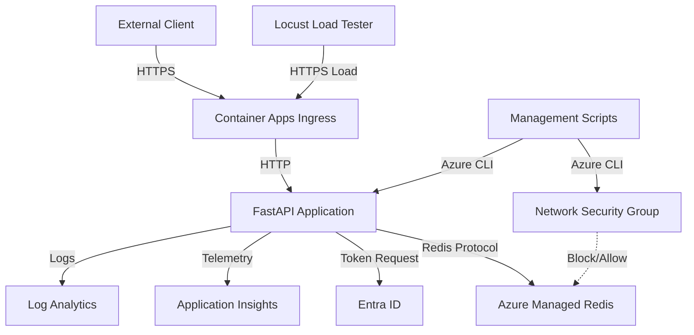

## 正常時のデータフロー

### 1. アプリケーション起動フロー
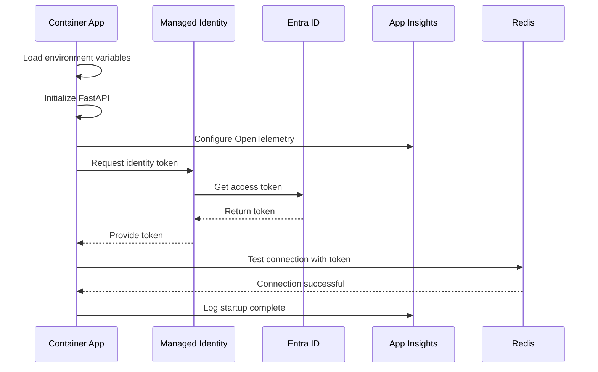

### 2. HTTPリクエスト処理フロー（正常系）
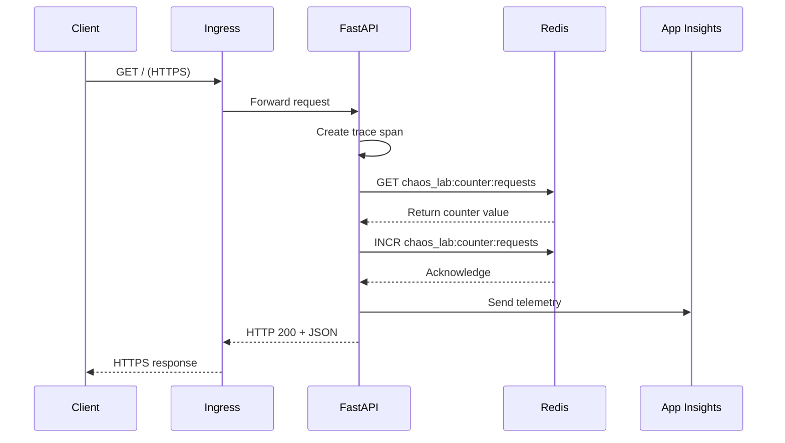

### 3. ヘルスチェックフロー
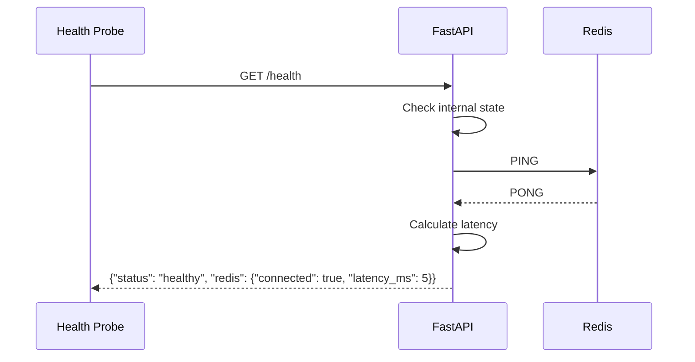

## 障害時のデータフロー

### 1. Redis接続障害フロー（NSGブロック）
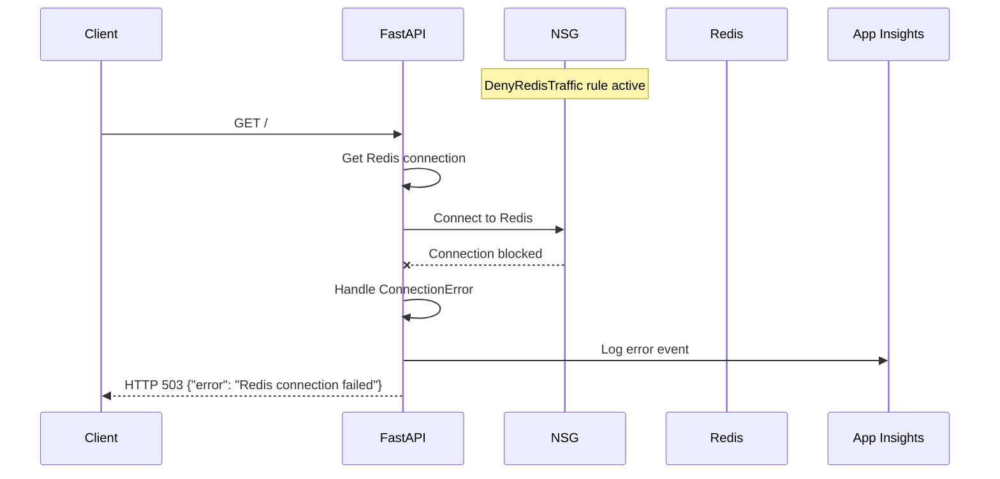

### 2. 認証障害フロー
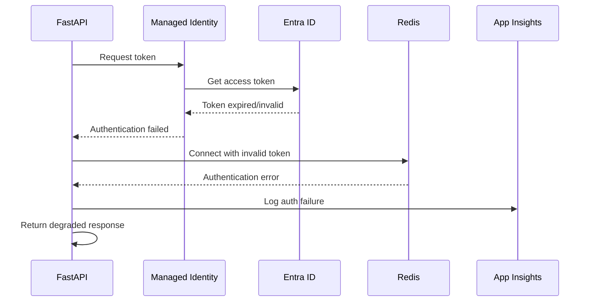

### 3. ハングアップフロー
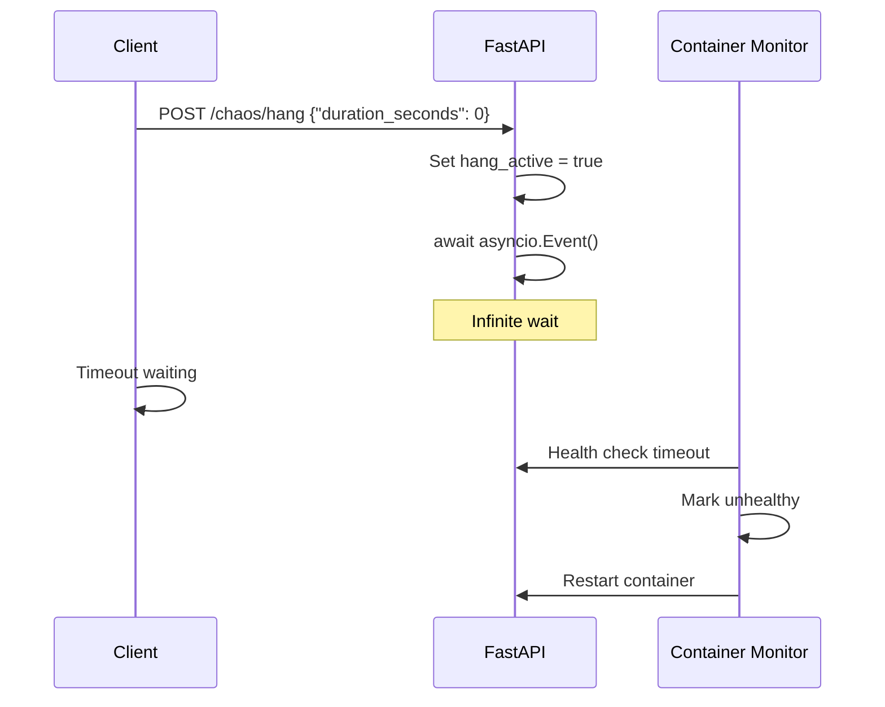

## 負荷時のデータフロー

### 1. 内部負荷生成フロー
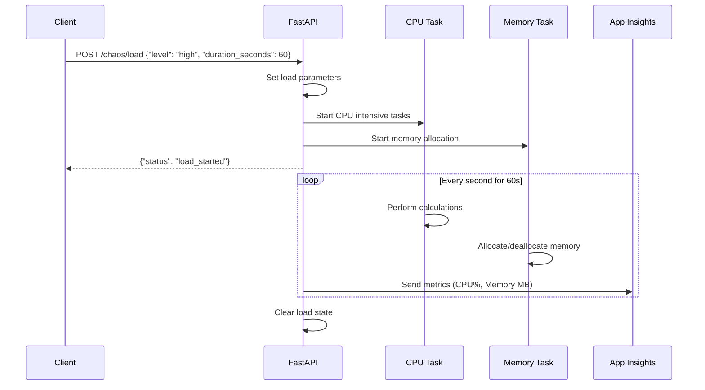

### 2. 外部負荷フロー（Locust）
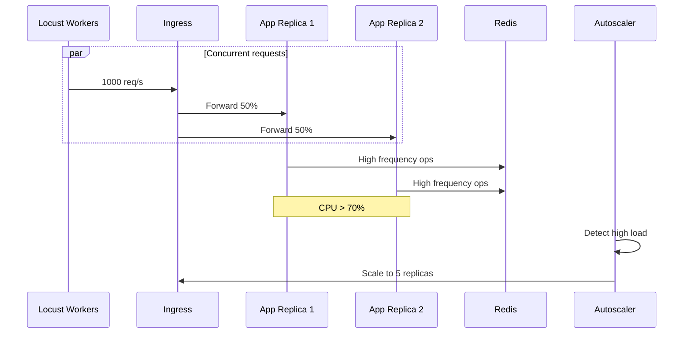

### 3. カスケード障害フロー
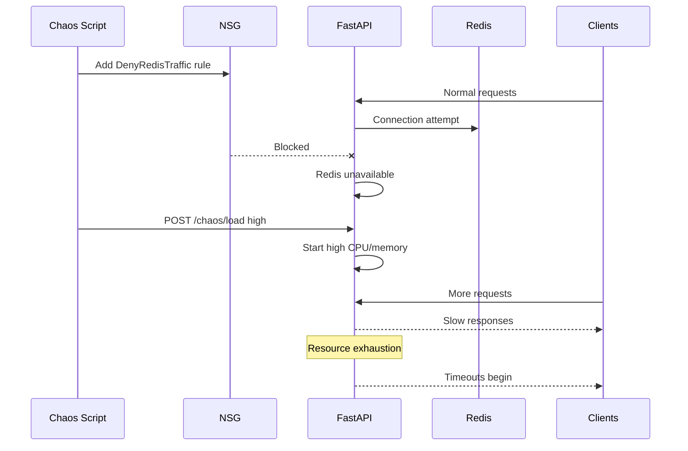

## 管理操作フロー

### 1. NSGルール操作フロー
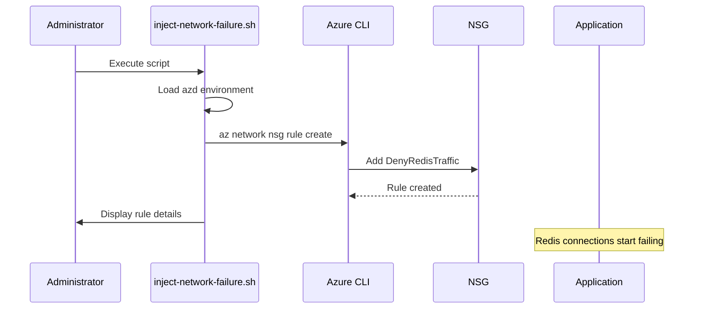

### 2. デプロイメント障害注入フロー
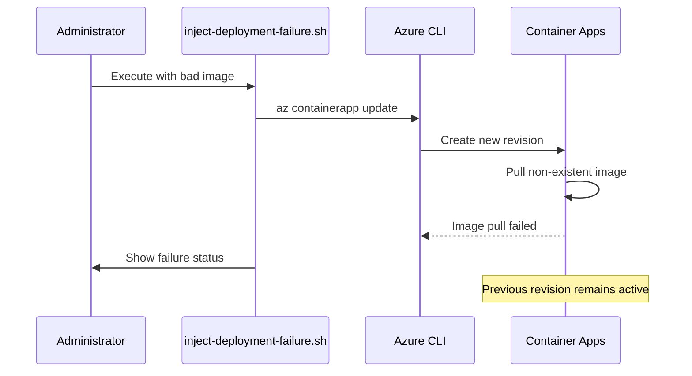

## データモデル相互作用

### Redis データ操作パターン
```python
# カウンター操作
GET "chaos_lab:counter:requests" → int/None
INCR "chaos_lab:counter:requests" → int

# サンプルデータ操作
SET "chaos_lab:data:sample" '{"timestamp": "...", "value": "..."}' → OK
GET "chaos_lab:data:sample" → JSON string

# ヘルスチェック記録
SET "chaos_lab:health:last_check" "2025-07-30T12:00:00Z" → OK
EXPIRE "chaos_lab:health:last_check" 300 → 1
```

### 内部状態管理
```python
# グローバル状態（メモリ内）
chaos_state = ChaosState()

# 状態更新フロー
POST /chaos/load → chaos_state.load_active = True
                 → chaos_state.load_level = "high"
                 → chaos_state.load_end_time = now() + duration

# 状態確認フロー
GET /chaos/status → return chaos_state.to_dict()

# 自動クリーンアップ
Background task → if now() > load_end_time:
                    chaos_state.load_active = False
```

## テレメトリフロー

### OpenTelemetry トレーシング
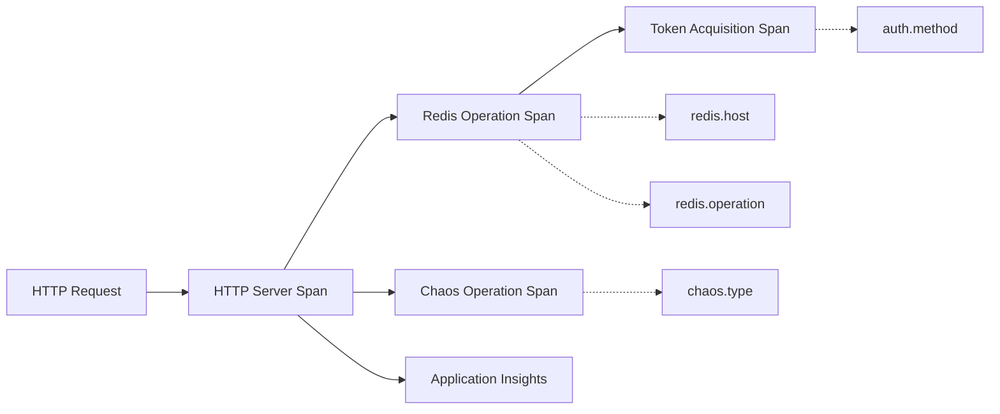

### メトリクス収集
```python
# カスタムメトリクス
- redis.connection.success: Counter
- redis.connection.failure: Counter
- redis.operation.latency: Histogram
- chaos.load.active: Gauge
- chaos.load.level: Gauge
- app.memory.usage: Gauge
- app.cpu.usage: Gauge
```

**出力**: データフローと相互作用の包括的なマッピング完了
**検証**: すべての主要なデータフローパターンと相互作用が文書化された
**次**: エッジケースと障害のカタログ化に進む