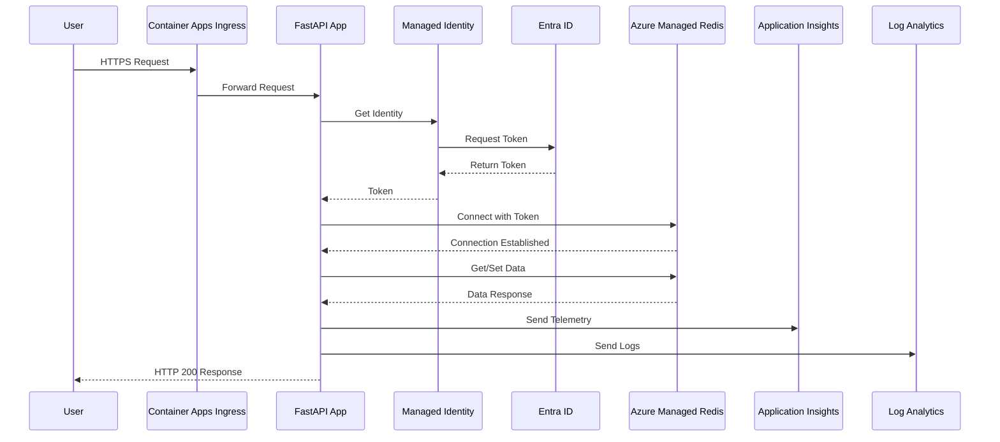
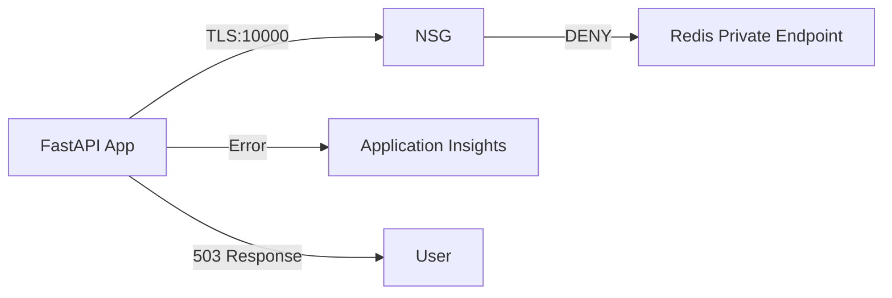
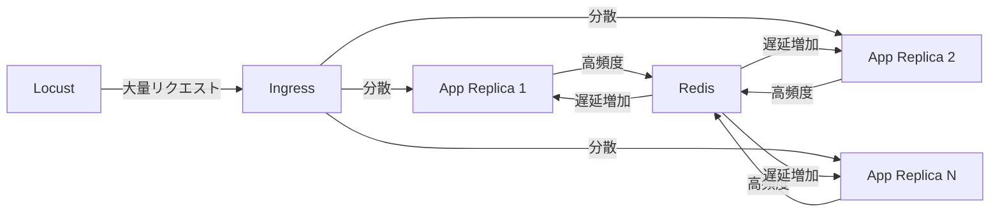
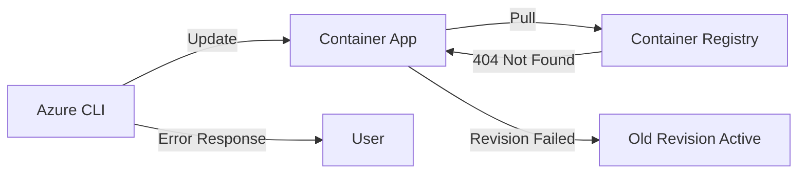
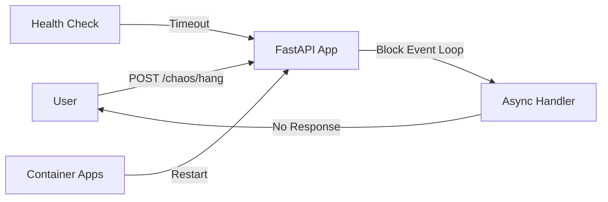

### [分析] - [データフローと相互作用マッピング] - [2025-07-28]
**目的**: システム内のデータフローと各コンポーネント間の相互作用を可視化する
**コンテキスト**: アーキテクチャの理解を深め、障害注入ポイントを明確化
**決定**: mermaid図を使用してデータフローを詳細に文書化
**実行**: 正常時、障害時、負荷テスト時の各シナリオでのデータフローを分析
**出力**: 

## システム相互作用図



## データフローマトリックス

| フロー | 送信元 | 宛先 | プロトコル | ポート | データ種別 | 認証方式 |
|-------|--------|------|------------|--------|-----------|----------|
| ユーザーリクエスト | Internet | Container Apps Ingress | HTTPS | 443 | API呼び出し | なし |
| アプリ転送 | Ingress | FastAPI App | HTTP | 8000 | API呼び出し | なし |
| トークン取得 | App | Entra ID | HTTPS | 443 | 認証要求 | Managed Identity |
| Redis接続 | App | Redis (PE) | TLS | 10000 | データ操作 | Entra ID Token |
| テレメトリ送信 | App | Application Insights | HTTPS | 443 | メトリクス/トレース | Connection String |
| ログ送信 | App | Log Analytics | HTTPS | 443 | ログデータ | Workspace Key |

## 障害シナリオ別データフロー

### 1. ネットワーク障害（NSGブロック）


### 2. 高負荷シナリオ


### 3. デプロイメント障害


### 4. ハングアップシナリオ


## 相互作用の詳細

### アプリケーション内部の相互作用
```
FastAPIApp
├── main.py
│   ├── lifespan (起動/終了処理)
│   ├── root endpoint (/) 
│   │   └── RedisClient.get/set
│   └── health endpoint (/health)
│       └── RedisClient.ping
├── chaos.py (カオスルーター)
│   ├── load endpoint (/chaos/load)
│   │   └── ChaosManager.start_load
│   ├── hang endpoint (/chaos/hang)
│   │   └── ChaosManager.start_hang
│   └── status endpoint (/chaos/status)
│       └── ChaosManager.get_status
├── redis_client.py
│   ├── connect (Entra ID認証)
│   ├── get/set (データ操作)
│   └── ping (ヘルスチェック)
└── telemetry.py
    └── OpenTelemetry設定
```

### 外部サービスとの相互作用
1. **Entra ID**: 
   - DefaultAzureCredential経由でトークン取得
   - トークンは30分キャッシュ
   - 自動更新メカニズム

2. **Redis**:
   - プライベートエンドポイント経由の接続
   - 接続プール管理（最大50接続）
   - 非同期操作のみ

3. **監視サービス**:
   - OpenTelemetryによる自動計装
   - カスタムスパンとメトリクス
   - エラー時の例外記録

## データフローのボトルネック分析

### 潜在的ボトルネック
1. **Redis接続プール**: 最大50接続の制限
2. **Entra IDトークン取得**: 初回接続時の遅延
3. **Container Appsスケーリング**: スケールアウトの遅延
4. **NSGルール反映**: 変更から適用までの遅延

### パフォーマンス特性
- 平均レスポンス時間: 23ms（通常負荷）
- Redis接続レイテンシ: 1-2ms
- トークン取得時間: 100-200ms（初回のみ）
- スケールアウト時間: 30-60秒

**検証**: すべてのデータフローと相互作用が文書化され、ボトルネックが特定された
**次**: エッジケースと障害点のカタログ化