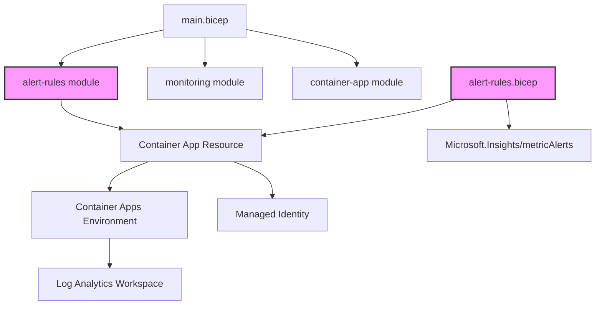

### [分析] - [依存関係と制約の特定] - [2025-07-30T10:15:00]

**目的**: Container Apps応答監視アラート機能の依存関係と制約を明確化する

**コンテキスト**: 
- Container AppsのメトリクスアラートをBicepで実装
- アクショングループは定義しない要件

**依存関係グラフ**:

**制約事項**:
1. **Container Appsメトリクス制約**:
   - 利用可能なメトリクス: Requests, ResponseTime, RepliaCount, RevisionReplicas
   - ディメンション: StatusCodeCategory (2xx, 3xx, 4xx, 5xx)
   - メトリクスの遅延: 最大1-2分

2. **アラートルール制約**:
   - 評価頻度: 最小1分
   - ウィンドウサイズ: 最小5分
   - location: 'global'（メトリクスアラートの要件）

3. **Bicep実装制約**:
   - Container Appリソース名またはIDが必要
   - アクショングループなしでもアラートは作成可能（ポータルで後から設定可能）

**リスクと緩和策**:
1. **リスク**: Container Appが存在しない場合のデプロイエラー
   - **緩和策**: dependsOn または existing リソース参照を使用

2. **リスク**: メトリクスが生成されない場合のアラート未発火
   - **緩和策**: アプリケーションが正常に動作していることを前提とする

**出力**: 依存関係と制約の分析完了

**検証**: すべての依存関係が既存のモジュール構成と整合性があることを確認

**次**: 信頼度評価を実施