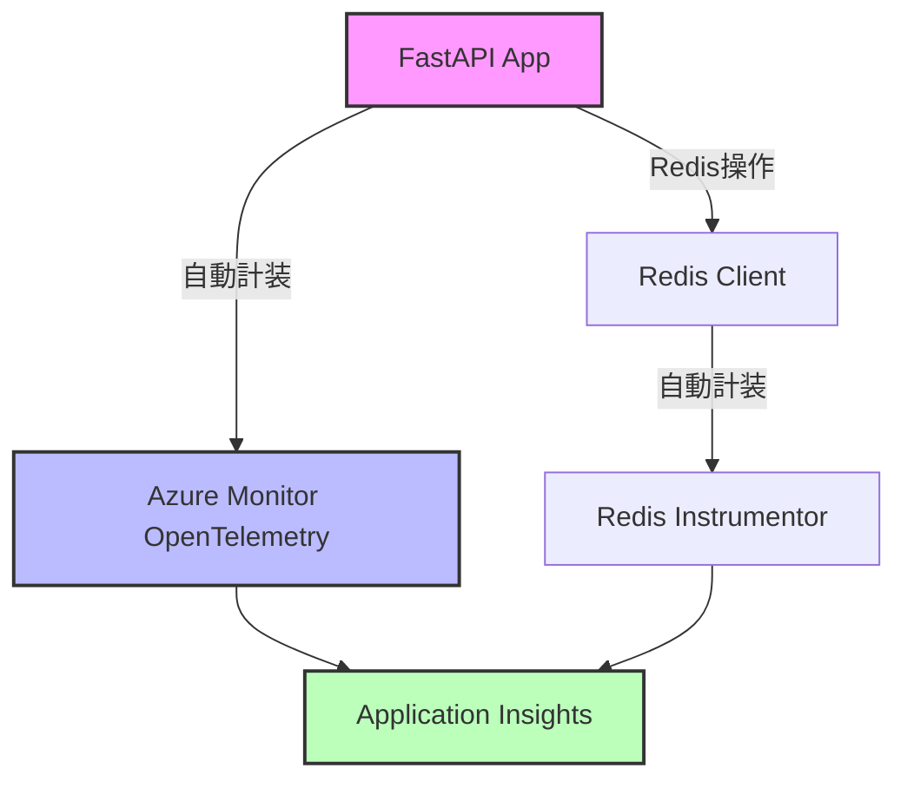
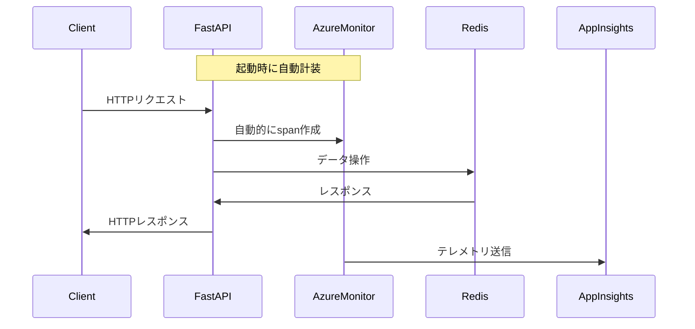

### [設計] - [OpenTelemetryシンプル化の技術設計] - [2025-07-31 10:15]

**目的**: Azure公式ドキュメントに基づいた包括的な技術設計と詳細な実装計画を作成する

**コンテキスト**: フェーズ1の分析結果に基づき、自動計装を活用したシンプルな実装を設計する

**決定**: Azure Monitor OpenTelemetryの自動計装機能を最大限活用し、手動のspan管理を完全に削除する

**実行**: 技術設計の作成と実装計画の策定

**出力**:

## 技術設計

### アーキテクチャ



### データフロー



### インターフェース変更

#### telemetry.py
```python
def setup_telemetry() -> None:
    """Configure Azure Application Insights telemetry."""
    # シンプルな初期化のみ
```

#### main.py
- `tracer`グローバル変数: 削除
- `_root_with_span()`: 削除
- `_health_with_span()`: 削除
- `root()`と`health()`: 直接ビジネスロジックを実装

### データモデル

変更なし（OpenTelemetryの内部実装に依存）

## エラー処理

### エラーマトリックス

| エラーシナリオ | 対応 | 影響 |
|--------------|-----|-----|
| 接続文字列未設定 | 警告ログ出力、テレメトリ無効 | アプリは正常動作 |
| OpenTelemetry初期化失敗 | エラーログ出力、テレメトリ無効 | アプリは正常動作 |
| Redis計装失敗 | エラーログ出力、Redis計装なし | アプリは正常動作 |

## 単体テスト戦略

### テスト対象の変更
1. **削除するテスト**
   - tracerの有無による分岐テスト
   - span作成のモックテスト

2. **維持するテスト**
   - エンドポイントの機能テスト
   - Redis操作のテスト
   - エラーハンドリングテスト

3. **追加するテスト**
   - telemetry.setup_telemetry()の初期化テスト
   - 環境変数未設定時の動作テスト

## 実装計画

### タスク1: telemetry.pyのシンプル化
- **説明**: Azure Monitor自動計装を使用するように書き換え
- **期待される結果**: コード行数50%削減、不要な設定削除
- **依存関係**: なし

### タスク2: main.pyの手動span管理削除
- **説明**: tracerグローバル変数と_with_spanメソッドを削除
- **期待される結果**: エンドポイントの実装がシンプルに
- **依存関係**: タスク1完了後

### タスク3: chaos.pyの確認
- **説明**: 自動計装により変更不要であることを確認
- **期待される結果**: 変更なし
- **依存関係**: なし

### タスク4: テストの更新
- **説明**: 削除した機能に関連するテストを更新
- **期待される結果**: テストがシンプル化に対応
- **依存関係**: タスク1,2完了後

### タスク5: 動作確認
- **説明**: ローカル環境での動作確認
- **期待される結果**: テレメトリが正常に送信される
- **依存関係**: タスク1-4完了後

## 技術的決定事項

### 決定 - 2025-07-31
**決定**: Azure Monitor OpenTelemetryの自動計装を採用
**コンテキスト**: 手動span管理の複雑性とメンテナンスコスト
**オプション**: 
1. 現状維持（手動span管理）
2. 自動計装への移行
3. カスタムミドルウェアの作成
**根拠**: Azure公式推奨、コード削減、バグリスク低減
**影響**: コード量50%削減、保守性向上
**レビュー**: 3ヶ月後に効果を評価

### 決定 - 2025-07-31
**決定**: Redis計装は個別に維持
**コンテキスト**: configure_azure_monitorにRedis計装が含まれない
**オプション**: 
1. 手動でRedisInstrumentor().instrument()
2. Redis計装を諦める
**根拠**: Redis操作の可視性は重要
**影響**: 1行の追加コードで済む
**レビュー**: Azure SDKの更新時に再評価

**検証**: 
- 設計は明確で実装可能
- リスクは最小限
- 大幅な簡素化が実現可能

**次**: フェーズ3（実装）に進む