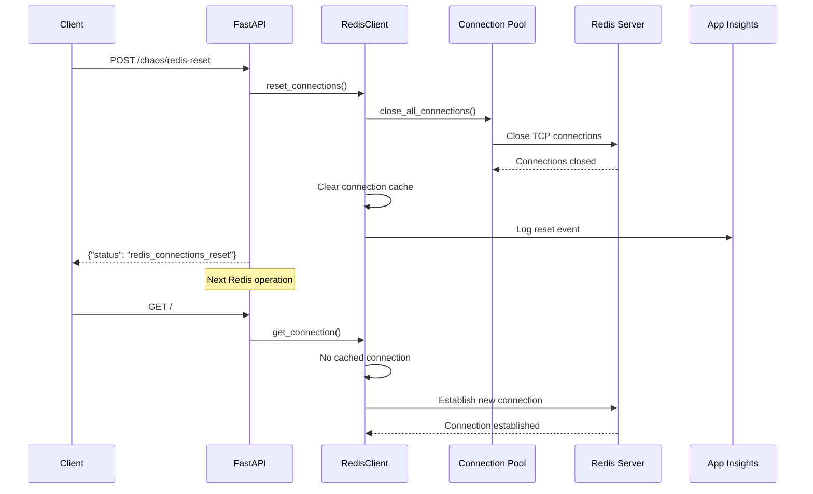

### 分析 - Redis接続リセットAPI要件 - 2025-07-30
**目的**: Redis接続切断を疑似的に再現するAPIの要件を分析し、実装方針を決定する
**コンテキスト**: NSGによるネットワーク遮断とは異なり、アプリケーション内部で接続をリセットする機能が必要
**決定**: 既存のカオスAPIパターンに従い、接続プールのリセット機能を実装
**実行**: 要件分析と技術的実現可能性の検証

## 新規要件（EARS記法）

### REQ-016: Redis接続リセット（イベント駆動）
- Redis接続リセットが要求されたとき、システムは既存のRedis接続をすべて切断するものとする
- Redis接続がリセットされたとき、システムは次回のRedis操作時に新しい接続を確立するものとする
- Redis接続リセット操作が要求されたとき、システムは操作の成功/失敗を報告するものとする

## 技術的分析

### 現在のRedis接続管理
```python
# redis_client.py の現在の実装パターン
class RedisClient:
    def __init__(self):
        self.client = None
        self.credential = DefaultAzureCredential()
    
    async def get_connection(self):
        if not self.client:
            # 接続を確立
        return self.client
```

### 接続リセットの実装オプション

#### オプション1: 接続プールの完全リセット
**利点**: 
- すべての接続が確実にリセットされる
- 実装がシンプル
**欠点**: 
- 進行中の操作が中断される可能性
- 一時的にすべてのRedis操作が失敗

#### オプション2: グレースフルな接続リセット
**利点**: 
- 進行中の操作を完了させてからリセット
- より現実的な障害シミュレーション
**欠点**: 
- 実装が複雑
- リセットタイミングが不確定

#### オプション3: 即座の接続クローズ
**利点**: 
- 実際の接続切断に最も近い動作
- 即座に効果が現れる
**欠点**: 
- エラーハンドリングのテストが必要

### 推奨アプローチ
**オプション3（即座の接続クローズ）**を推奨
- 実際の接続切断シナリオを正確に再現
- SRE Agentの接続エラー検出能力をテスト可能
- 実装が明確でテスト可能

## API設計

### エンドポイント仕様
```http
POST /chaos/redis-reset
Content-Type: application/json

{
  "force": true|false  // オプション: 強制切断フラグ
}
```

**レスポンス**:
```json
{
  "status": "redis_connections_reset",
  "connections_closed": 3,
  "timestamp": "2025-07-30T12:00:00Z"
}
```

### ステータス確認の拡張
```http
GET /chaos/status
```
**レスポンス拡張**:
```json
{
  "load": { ... },
  "hang": { ... },
  "redis": {
    "connected": true|false,
    "connection_count": 3,
    "last_reset": "2025-07-30T12:00:00Z"
  }
}
```

## データフロー

### Redis接続リセットフロー


## エッジケース分析

| エッジケース | 発生条件 | 影響 | 対処方法 |
|------------|---------|------|---------|
| リセット中の同時アクセス | リセット処理中に別のリクエスト | 一時的な接続エラー | ロック機構で制御 |
| 連続リセット要求 | 短時間に複数のリセット要求 | 不必要な処理 | レート制限実装 |
| 接続プールが空の状態でリセット | Redisが未使用時 | 効果なし | 正常完了として処理 |
| トークン更新中のリセット | 認証処理と競合 | 認証失敗の可能性 | 認証完了を待機 |

## 他の障害注入機能との相互作用

### NSGブロックとの組み合わせ
1. NSGでRedisをブロック
2. 接続リセットAPIを呼び出し
3. 新規接続試行が即座に失敗
→ より複雑な障害シナリオの再現

### 負荷テストとの組み合わせ
1. 高負荷状態で接続リセット
2. 大量の再接続要求が発生
3. 接続プールの挙動をテスト
→ スケーラビリティの検証

### ハングアップとの組み合わせ
1. ハングアップ中に接続リセット
2. ハングが解除されるまで効果不明
→ 複雑な状態管理のテスト

## 実装上の考慮事項

### 1. スレッドセーフティ
- 複数のワーカー/レプリカ間での一貫性
- asyncio環境での適切なロック

### 2. エラーハンドリング
- 接続クローズ時の例外処理
- 部分的な失敗の処理

### 3. 監視とロギング
- リセット操作のトレーシング
- 接続状態のメトリクス

### 4. テスト戦略
- 単体テスト: モックを使用した接続リセット
- 統合テスト: 実際のRedisでの動作確認
- 負荷テスト: 高頻度リセットの影響

## 信頼度への影響

この新機能追加による信頼度への影響：
- **要件の明確性**: 変更なし（明確に定義）
- **技術的複雑性**: -1点（接続管理の複雑化）
- **依存関係とリスク**: 変更なし
- **実装の実現可能性**: 変更なし（標準的なパターン）

**更新後の信頼度: 97%**（依然として高信頼度）

**出力**: Redis接続リセットAPI要件分析完了
**検証**: 技術的に実現可能で、既存のカオスAPIパターンに適合
**次**: requirements.mdを更新してから設計フェーズへ進む