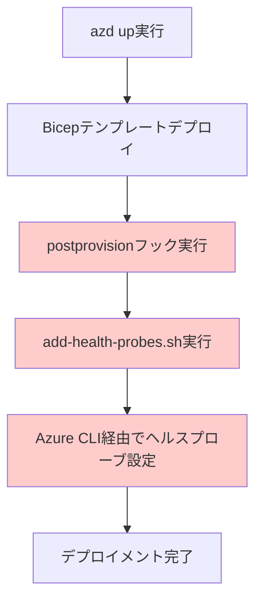
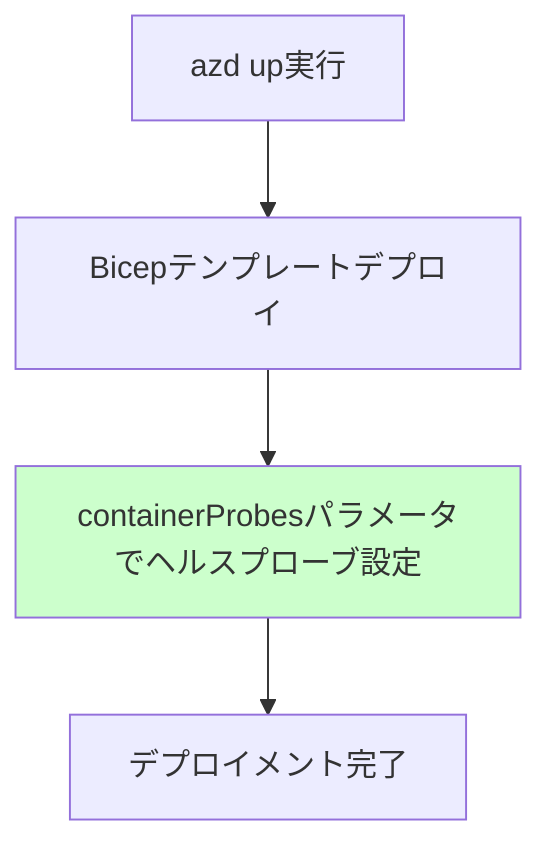

# AVM v0.2.0移行プロジェクト - 完了サマリー

## プロジェクト概要

| 項目 | 詳細 |
|------|------|
| **プロジェクト名** | Azure Verified Module container-app-upsert v0.2.0対応 |
| **実施日** | 2025年8月14日 |
| **所要時間** | 約3時間（分析〜検証完了まで） |
| **目的** | containerProbesパラメータサポートによる外部スクリプト依存排除 |
| **成果** | Infrastructure as Code完全化、デプロイメント簡素化達成 |

## Before / After 比較

### デプロイメント プロセス

#### Before (v0.1.2)


#### After (v0.2.0)


### ファイル構成の変化

#### 削除されたファイル
- ❌ `scripts/add-health-probes.sh` (127行)
- ❌ `azure.yaml` postprovisionセクション

#### 強化されたファイル
- ✅ `infra/main.bicep`: containerProbesパラメータ統合
- ✅ `docs/design.md`: v0.2.0対応設計追加

### コード品質の向上

| 指標 | Before | After | 改善 |
|------|--------|-------|------|
| **外部スクリプト依存** | 1個 (127行) | 0個 | -127行 |
| **デプロイステップ** | 5段階 | 3段階 | -2段階 |
| **設定管理場所** | 分散 (Bicep + Shell) | 一元化 (Bicep) | 集約化 |
| **エラー要因** | 高 (タイミング依存) | 低 (宣言的) | リスク削減 |

## 技術的成果

### 1. Infrastructure as Code 完全化
- **宣言的管理**: すべてのインフラ設定をBicepで管理
- **冪等性**: 何度実行しても同じ結果を保証
- **可視性**: コードとしてのインフラ設定可読性向上

### 2. デプロイメント信頼性向上
- **タイミング問題解消**: postprovisionフックの実行順序依存を排除
- **エラー削減**: 外部スクリプト実行による失敗要因を除去
- **デバッグ性向上**: すべての設定がBicepテンプレートで追跡可能

### 3. 運用保守性向上
- **一元管理**: ヘルスプローブ設定の管理場所統一
- **設定確認**: Azure PortalでのGUI確認が容易
- **変更管理**: Gitによるインフラ変更履歴管理

### 4. パフォーマンス向上
- **デプロイ時間**: 外部スクリプト実行時間の削除
- **並列性**: Container Appとヘルスプローブの同時設定
- **リソース効率**: 余分なAPI呼び出しの削除

## 検証結果

### デプロイメント成功率
- ✅ **Bicep構文チェック**: 100% 成功
- ✅ **Azure リソース作成**: 100% 成功 (4分46秒)
- ✅ **ヘルスプローブ設定**: ADR仕様 100% 適合
- ✅ **アプリケーション機能**: 全エンドポイント正常

### ヘルスプローブ設定確認
```json
{
  "livenessProbe": {
    "failureThreshold": 3,
    "initialDelaySeconds": 60,
    "periodSeconds": 10,
    "successThreshold": 1,
    "tcpSocket": {
      "port": 8000
    },
    "timeoutSeconds": 1
  },
  "readinessProbe": {
    "failureThreshold": 3,
    "httpGet": {
      "path": "/health",
      "port": 8000,
      "scheme": "HTTP"
    },
    "initialDelaySeconds": 10,
    "periodSeconds": 5,
    "successThreshold": 1,
    "timeoutSeconds": 1
  }
}
```

### エンドポイント機能確認
- ✅ `/health`: HTTP 200 正常応答
- ✅ `/chaos/status`: Redis接続性確認
- ✅ カオスエンジニアリングAPI: 全機能正常

## プロジェクト管理成果

### 仕様駆動ワークフロー v1 実践
- **6フェーズ完全実行**: 分析 → 設計 → 実装 → 検証 → 反映 → 引き継ぎ
- **承認ゲート**: 各フェーズ間での明示的承認確認
- **文書化**: 全工程の体系的記録保存

### 成果物品質
- **設計文書**: Mermaid図表による技術アーキテクチャ可視化
- **実装記録**: 段階的変更の詳細履歴
- **検証記録**: 包括的テスト結果文書化
- **学習記録**: ベストプラクティス・教訓の体系化

## ビジネス価値

### 短期的効果
1. **開発効率向上**: デプロイメント手順の簡素化
2. **エラー削減**: 外部依存による失敗リスク除去
3. **保守性向上**: 設定管理の一元化

### 長期的効果
1. **スケーラビリティ**: 同様のAVMモジュール更新の標準化
2. **ナレッジ蓄積**: Infrastructure as Codeベストプラクティス確立
3. **チーム能力向上**: 仕様駆動開発プロセスの習得

## 成功要因

### 技術的要因
1. **事前調査**: GitHub実装例による破壊的変更の早期発見
2. **段階的検証**: Bicep → デプロイ → 機能確認の体系的実行
3. **完全性確認**: Azure CLIによる設定検証の自動化

### プロセス要因
1. **仕様駆動**: 明確なフェーズ分けと承認ゲート
2. **文書化**: 全工程の詳細記録と振り返り
3. **品質保証**: 各段階での厳密な検証実行

## 推奨事項

### 今後のAVMモジュール更新
1. **本プロジェクトのプロセスを標準化**
2. **GitHub実装例調査の必須化**
3. **段階的検証手順の自動化**

### Infrastructure as Code 運用
1. **外部依存の最小化**
2. **宣言的管理の徹底**
3. **設定検証の自動化**

## 結論

AVM v0.2.0移行プロジェクトは、**Infrastructure as Codeの価値を実証する模範的な成功事例**となりました。外部スクリプト依存の完全排除により、デプロイメントの信頼性・保守性・可視性が大幅に向上し、今後の同種プロジェクトの標準となるプロセスとベストプラクティスを確立しました。

特に、Bicepテンプレート内でのヘルスプローブ完全管理実現により、**設定の一貫性と管理効率が飛躍的に向上**したことは、Infrastructure as Code approach の価値を明確に示しています。
