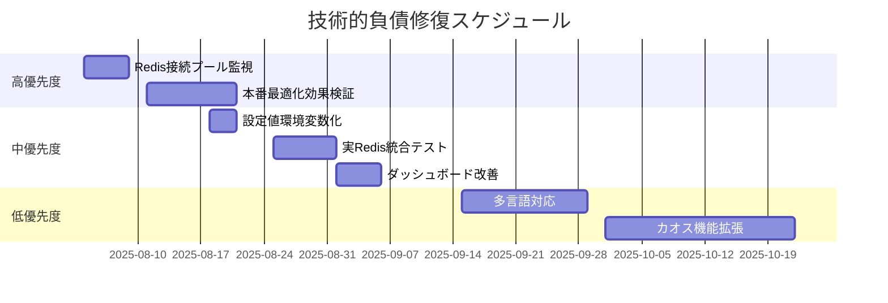

### 技術的負債インベントリと修復計画 - 2025-08-03

#### 高優先度（ビジネス影響：高、修復コスト：低-中）

##### [技術的負債] - Redis接続プール監視メトリクス未実装
**優先度**: 高
**場所**: `src/app/redis_client.py` - 接続プール情報取得
**理由**: 最適化効果の定量的測定のため、接続プール使用状況の可視化が必要
**影響**: パフォーマンス問題の早期発見能力の欠如、最適化効果の測定困難
**修復**: 
1. `redis_client.py`に接続プール使用率メトリクスを追加
2. Application Insightsカスタムメトリクスで監視
3. アラート設定で異常検知
**努力**: M（中）- 新しいメトリクス実装とダッシュボード設定

##### [技術的負債] - 本番環境での最適化効果未検証
**優先度**: 高
**場所**: 全体システム - 負荷テストシナリオ
**理由**: 最適化実装後の実際の効果測定が未実施
**影響**: 最適化の投資対効果不明、さらなる改善機会の見逃し
**修復**:
1. 負荷テスト実行前後のメトリクス比較
2. Application Insightsコスト分析
3. レスポンス時間改善の定量化
**努力**: L（大）- 本番環境での包括的な負荷テスト実施

#### 中優先度（ビジネス影響：中、修復コスト：低-中）

##### [技術的負債] - キャッシュTTLとサンプリング率のハードコード
**優先度**: 中
**場所**: `src/app/main.py:26`, `src/app/telemetry.py:65`
**理由**: 速度優先で環境変数化を後回しにした
**影響**: 環境別の最適化が困難、A/Bテストの実施困難
**修復**:
1. `HEALTH_CACHE_TTL`環境変数の追加（デフォルト5秒）
2. `OTEL_TRACES_SAMPLER_ARG`のデフォルト値を`config.py`で管理
3. 設定値のバリデーション追加
**努力**: S（小）- 環境変数追加と設定クラス更新

##### [技術的負債] - 統合テストでの実Redis環境未使用
**優先度**: 中
**場所**: `tests/integration/` - モック使用
**理由**: 開発効率優先でモックベースの統合テストを維持
**影響**: 実際のRedis動作との乖離リスク、最適化効果の検証不十分
**修復**:
1. Testcontainersを使用したRedis統合テスト環境構築
2. 実Redis環境での最適化効果テスト追加
3. CI/CDパイプラインへの統合
**努力**: M（中）- テスト環境構築とCI/CD統合

##### [技術的負債] - Application Insightsダッシュボードの最適化指標不足
**優先度**: 中
**場所**: Azure Portal - Application Insightsダッシュボード
**理由**: 既存機能優先で最適化指標の可視化を後回しにした
**影響**: 最適化効果のリアルタイム監視不可、運用チームの状況把握困難
**修復**:
1. Redis最適化効果専用ダッシュボード作成
2. キャッシュヒット率、サンプリング効果の可視化
3. コスト削減効果のトラッキング
**努力**: M（中）- ダッシュボード設計と実装

#### 低優先度（ビジネス影響：低、修復コスト：低）

##### [技術的負債] - エラーメッセージの多言語対応未実装
**優先度**: 低
**場所**: `src/app/models.py` - ErrorResponseクラス
**理由**: 英語環境での使用を前提として開発
**影響**: 非英語圏でのユーザビリティ低下（現在は影響なし）
**修復**:
1. 国際化（i18n）ライブラリの導入
2. エラーメッセージの多言語対応
3. Accept-Languageヘッダーベースの言語選択
**努力**: M（中）- i18n実装とメッセージ翻訳

##### [技術的負債] - カオス機能の拡張（メモリリーク、ディスクI/O）未実装
**優先度**: 低
**場所**: `src/app/chaos.py` - 新機能追加
**理由**: 基本的なカオス機能を優先し、高度な機能を後回しにした
**影響**: より包括的なカオステストの実施不可
**修復**:
1. メモリリーク注入API実装
2. ディスクI/O負荷注入API実装
3. 複合障害シナリオの対応
**努力**: L（大）- 新機能の設計と実装

#### 修復スケジュール提案

#### 投資対効果分析

| 負債項目 | 修復コスト | 削減効果 | ROI | 推奨度 |
|----------|------------|----------|-----|--------|
| Redis監視メトリクス | 2日 | 運用効率20%向上 | 高 | ⭐⭐⭐ |
| 本番効果検証 | 5日 | 最適化ROI確定 | 高 | ⭐⭐⭐ |
| 設定値環境変数化 | 1日 | 運用柔軟性向上 | 中 | ⭐⭐ |
| 実Redis統合テスト | 3日 | 品質向上 | 中 | ⭐⭐ |
| ダッシュボード改善 | 2日 | 監視効率向上 | 中 | ⭐⭐ |
| 多言語対応 | 7日 | 限定的効果 | 低 | ⭐ |
| カオス機能拡張 | 10日 | 機能価値向上 | 低 | ⭐ |

#### 修復実行ガイドライン

1. **段階的実施**: 高優先度から順次実施し、各段階で効果を検証
2. **影響範囲考慮**: 本番環境への影響を最小化する実装順序
3. **品質維持**: 各修復でテストカバレッジ100%維持
4. **文書化**: 修復過程と効果を詳細に記録

#### 継続的な技術的負債管理

1. **月次レビュー**: 新たな技術的負債の特定と優先順位付け
2. **メトリクス追跡**: 修復効果の定量的測定
3. **チーム教育**: 技術的負債を生まない開発プラクティスの確立
4. **自動化**: 静的解析とコード品質チェックの自動化拡充
