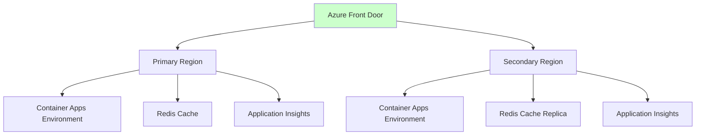

# 技術的負債と改善機会の識別

## 現在の技術的負債

### 1. Redis関連警告 (BCP081)

#### 課題の詳細
- **警告内容**: Bicepテンプレートコンパイル時のBCP081警告
- **影響範囲**: 開発者体験（警告ノイズ）
- **現在の対応**: `#disable-next-line BCP081` による抑制

#### 根本原因
- Azure Cache for Redis のBicepリソース定義における既知の問題
- Microsoft側のリソースプロバイダ仕様の不整合

#### 改善提案
```bicep
// 将来的改善案：Microsoft修正待ち
// 1. Azure Cache for Redis の新しいAPIバージョン採用
// 2. 代替リソース定義方法の検討
// 3. AVM Redis モジュールのアップデート確認
```

**優先度**: 低（機能影響なし）
**対応時期**: 次回メジャーアップデート時

### 2. モニタリング設定の限定性

#### 課題の詳細
- **現状**: 基本的なApplication Insightsのみ
- **不足要素**: 
  - カスタムメトリクス定義
  - 詳細アラートルール設定
  - ダッシュボード構成

#### 改善提案
1. **カスタムメトリクス追加**
   - Redis接続プールメトリクス
   - カオス実験実行回数・成功率
   - API応答時間詳細分析

2. **アラートルール強化**
   - ヘルスプローブ失敗率アラート
   - Redis接続エラーアラート
   - 異常なレスポンス時間アラート

3. **運用ダッシュボード作成**
   - リアルタイム健全性表示
   - 過去24時間のトレンド分析
   - カオス実験影響度可視化

**優先度**: 中（運用効率向上）
**対応時期**: 次期機能開発時

### 3. テスト自動化の限定性

#### 課題の詳細
- **現状**: 基本的な単体テスト・統合テストのみ
- **不足要素**:
  - Infrastructure テスト (Terratest/PSRule)
  - End-to-End テスト自動化
  - パフォーマンステスト継続実行

#### 改善提案
1. **Infrastructure テスト導入**
```powershell
# PSRule for Azure による Bicep テスト
Install-Module PSRule.Rules.Azure
Test-AzRuleTemplate -TemplatePath infra/main.bicep
```

2. **E2E テスト自動化**
   - GitHub Actions での継続的テスト
   - 複数環境での動作確認
   - リグレッションテスト自動化

3. **パフォーマンステスト継続化**
   - 定期的な負荷テスト実行
   - パフォーマンス劣化アラート
   - ベースライン比較レポート

**優先度**: 中（品質保証向上）
**対応時期**: 次期開発サイクル

## 将来の機能拡張機会

### 1. マルチリージョン対応

#### 拡張概要
- **目的**: 高可用性・災害復旧対応
- **対象**: Container Apps Environment, Redis, Application Insights

#### 実装アプローチ


**優先度**: 低（現在は単一リージョンで十分）
**対応時期**: ビジネス要件次第

### 2. セキュリティ強化

#### 強化領域
1. **ネットワークセキュリティ**
   - Private Endpoint による内部通信
   - Network Security Group ルール詳細化
   - Web Application Firewall 導入

2. **認証・認可**
   - Azure AD 統合
   - API キー ローテーション自動化
   - RBAC 詳細化

3. **監査・コンプライアンス**
   - Azure Security Center 統合
   - 監査ログ強化
   - コンプライアンス レポート自動生成

**優先度**: 高（セキュリティは継続的課題）
**対応時期**: セキュリティレビュー時

### 3. カオスエンジニアリング機能拡張

#### 拡張機能
1. **実験パターン追加**
   - CPU使用率制限実験
   - メモリ不足シミュレーション
   - 外部API遅延注入

2. **実験スケジューリング**
   - 定期実験自動実行
   - 営業時間外での安全実験
   - 段階的影響度拡大

3. **結果分析強化**
   - 実験影響度定量化
   - 復旧時間測定・分析
   - レジリエンス スコア算出

**優先度**: 中（カオスエンジニアリング価値向上）
**対応時期**: プロダクト成熟度次第

## アーキテクチャ進化計画

### Phase 1: 安定化 (次3-6ヶ月)
- Redis警告対応
- モニタリング強化
- テスト自動化充実

### Phase 2: 拡張 (6-12ヶ月)
- セキュリティ強化実装
- カオス機能拡張
- パフォーマンス最適化

### Phase 3: 発展 (12ヶ月以降)
- マルチリージョン対応検討
- 次世代アーキテクチャ研究
- 新技術導入評価

## 優先順位マトリックス

| 改善項目 | 影響度 | 実装難易度 | 優先度 | 対応時期 |
|----------|--------|------------|--------|----------|
| Redis警告対応 | 低 | 低 | 低 | メンテナンス時 |
| モニタリング強化 | 中 | 中 | 中 | 次期開発 |
| テスト自動化 | 中 | 中 | 中 | 次期開発 |
| セキュリティ強化 | 高 | 高 | 高 | レビュー時 |
| カオス機能拡張 | 中 | 中 | 中 | 機能要求時 |
| マルチリージョン | 低 | 高 | 低 | ビジネス要件時 |

## まとめ

現在のシステムは**高い安定性と機能性**を実現していますが、運用効率化・セキュリティ強化・監視充実の観点で継続的改善の余地があります。特に、モニタリング強化とテスト自動化は比較的低コストで大きな価値を提供できるため、次期開発での優先検討を推奨します。

技術的負債は最小限に抑えられており、**健全なアーキテクチャ状態**を維持していることが確認できました。
